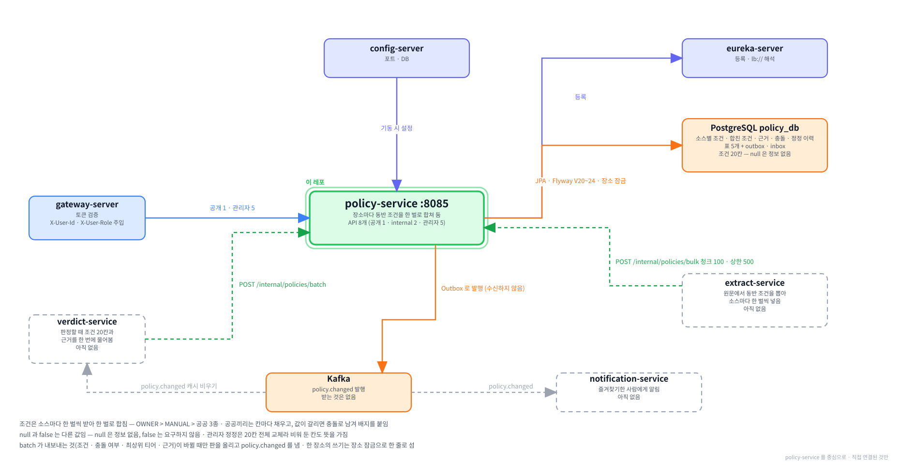

# policy-service

**함께하개**는 반려동물과 함께 갈 수 있는 장소를 찾고, 우리 아이가 그곳에
들어갈 수 있는지 판정해 주는 서비스입니다.

이 저장소는 그중 **장소마다 동반 조건을 맡는 서버**입니다.
출처마다 다르게 적힌 조건을 한 벌로 합쳐 두고, 그 조건이 바뀌면 판정하는 쪽에 알립니다.

---

**먼저 전체 그림을 보고, 이 레포가 그 안 어디에 있는지 본 뒤 읽습니다.**

**① 전체 구조 — 층으로 본 것.** 위에서 아래로 요청이 내려가고, 어느 층에 무엇이 있는지.


**② 전체 구조 — 서비스끼리 무엇을 주고받는지.** 초록 실선이 `/internal` 호출, Kafka 표가 이벤트, 하늘색 점선이 VPC 경계.


**③ 이 레포를 중심으로.** 직접 연결된 것만 남긴 그림.



<br><br>

---

## 본문 시작

<br><br>

---
## 0. 이 서비스가 하는 일

### 0-1. 한 문장

```
                                          ┌──▶  verdict 가 판정 재료로 읽음
extract 가 출처마다 넣음   ──▶   policy ──┼──▶  장소 상세가 충돌 목록을 보여줌
관리자가 고친 값           ──▶ (이 레포)  └──▶  바뀌면 policy.changed 로 알림
```

**장소마다 "반려동물과 들어가려면 무엇이 필요한가" 를 한 벌로 들고 있는 곳입니다.**
그 조건으로 우리 아이가 들어갈 수 있는지 답하는 일은 `verdict` 가 합니다.

---

### 0-2. 다른 서비스와의 자리

판정은 두 값을 견주는 일입니다. 장소가 무엇을 요구하는지와, 우리 아이가 어떤 아이인지입니다.
이 서비스는 **앞쪽 절반**을 소유합니다.

```
장소 모으기      place       어디에 갈 수 있는지
조건 뽑기        extract     "10kg 이하" 같은 문장에서 조건을 뽑음
조건 담기        policy      ← 이 레포.  그 장소가 요구하는 것
반려동물         pet         우리 아이가 어떤 아이인지
판정하기         verdict     위 둘을 견주어 답함
```

| | 이 서비스가 | |
|---|---|---|
| 하는 것 | 출처별 조건을 받아 한 벌로 합치고, 근거와 충돌을 남기고, 판정 재료로 내어 주고, 바뀌면 알림 | |
| 안 하는 것 | 조건 뽑기 | `extract` 몫. 원문을 읽는 곳은 여기가 아님 |
| | 판정 | `verdict` 몫. 이 서비스는 재료만 줌 |
| | 장소가 있는지 확인 | `place` 몫. 모르는 장소를 물어도 빈 결과로 답함 |
| | 조회 캐시 | `verdict` 가 둠 |

⛔**이 서비스는 다른 서비스를 부르지도, 이벤트를 받지도 않습니다.** 불리기만 하고 이벤트는 보내기만 합니다.
그래서 이 서비스 하나를 볼 때 따라가야 할 바깥 호출이 없습니다.

---

### 0-3. 무엇이 들어 있나

```
policy_db
  pet_policy_source       출처별 조건 한 벌.  한 장소에 출처마다 한 줄
  pet_policy              합친 조건 한 벌.  verdict 가 읽는 것
  policy_evidence         근거.  그 값이 원문 어디에서 나왔는지
  policy_conflict         충돌.  출처끼리, 또는 한 출처 안에서 값이 갈린 기록
  policy_correction_log   관리자 정정 이력.  고치지 않고 쌓기만 함
  + outbox                공통 대역.  policy.changed 를 내보냄
  + processed_event       공통 대역.  받는 이벤트가 없어 늘 비어 있음
```

**조건이 2곳에 있는 것이 이 서비스의 핵심입니다.**
출처가 준 것은 `pet_policy_source` 에 그대로 두고, 합친 결과만 `pet_policy` 에 따로 둡니다.
합치는 규칙이 바뀌어도 출처가 준 값이 남아 있어 언제든 다시 합칠 수 있습니다.

| 서비스 | 이벤트 |
|---|---|
| `auth` | 보내기만 함 |
| `place` | 보내기만 함 |
| `user` | 받기만 함 |
| `pet` | 보내고 받음 |
| `policy` | 보내기만 함 |

표를 만드는 것은 공통 모듈의 `V1__outbox.sql` · `V2__inbox.sql` 과 이 레포의 `V20` ~ `V25` 6개입니다.

---

### 0-4. 5가지만 기억하면 됩니다

**① 조건은 20칸이고, 칸마다 값이 셋입니다**

```
예          true      이동장이 필요함
아니오      false     이동장이 필요 없음
정보 없음   null      출처가 이 칸에 대해 아무 말도 안 함
```

⛔**`false` 와 `null` 은 판정이 다릅니다.** `carrierRequired` 가 `false` 면 이동장이 없어도 들어가고,
`null` 이면 이동장이 필요한지 모르는 것이라 판정이 "확인 필요" 쪽으로 갑니다.
둘을 섞으면 모르는 장소를 괜찮다고 답하게 됩니다. 20칸 전부는 [2장](#2-출처마다-말이-다릅니다)에 있습니다.

**② 출처마다 한 벌씩 받습니다**

```
PET_TOUR      한국관광공사 반려동물 동반여행
GOCAMPING     고캠핑
CULTURE_CSV   한국문화정보원 반려동물 동반 문화시설
MANUAL        관리자가 정정한 값
OWNER         장소 운영자가 알려 준 값.  관리자가 대신 넣음
```

앞의 셋은 `extract` 가 원문에서 뽑아 넣고, 뒤의 둘은 관리자 API 로만 들어옵니다.
한 장소에 출처마다 한 줄이라, 같은 출처를 다시 넣으면 새 줄이 생기지 않고 그 줄이 바뀝니다.

**③ 합칠 때는 사람이 정한 값이 이깁니다**

```
OWNER 가 있으면         그 한 벌이 통째로 결과
없고 MANUAL 이 있으면   그 한 벌이 통째로 결과
둘 다 없으면            공공 3종을 칸마다 채움.  PET_TOUR → GOCAMPING → CULTURE_CSV 순
```

공공 3종은 앞 출처가 비워 둔 칸을 뒤 출처가 채웁니다. 자세한 것은 [3장](#3-어떻게-한-벌로-합치는가)에 있습니다.

**④ 값이 갈리면 버리지 않고 충돌로 남깁니다**

한 출처는 "10kg 이하", 다른 출처는 "15kg 이하" 라고 하면 우선순위대로 하나를 쓰되,
갈렸다는 사실을 `policy_conflict` 에 적고 `hasConflict` 를 켭니다.
장소 상세는 판정 응답의 `hasConflict` 로 배지를 붙이고, 참일 때만 충돌 목록을 부릅니다.

⚠**한쪽만 값이 있는 것은 충돌이 아닙니다.** 출처마다 채우는 칸이 달라 흔한 일이고,
그것까지 세면 여러 출처가 붙은 장소 대부분에 배지가 붙습니다.

**⑤ 판정에 쓰는 것이 바뀔 때만 판이 오르고 알립니다**

`pet_policy.policy_version` 이 판입니다. 조건 · 충돌 여부 · 이긴 출처 · 근거 중 하나라도 바뀌면 판이 오르고
`policy.changed` 를 보냅니다. 같은 값을 다시 넣으면 판도 이벤트도 그대로입니다.
자세한 것은 [4장](#4-판이-오르면-알립니다)에 있습니다.

---

### 0-5. 화면에서 어디에 쓰이나

| 화면 | 부르는 것 |
|---|---|
| 검색 결과 · 즐겨찾기 카드 — 들어갈 수 있는지 | `verdict` 가 `POST /internal/policies/batch` 로 대신 물음 |
| 장소 상세 — 판정 | 같은 `batch` 를 장소 하나로 부름 |
| 장소 상세 — 조건 충돌 목록 | `GET /api/v1/places/{placeId}/conflicts`. 판정 응답의 `hasConflict` 가 참일 때만 부름 |
| 관리자 — 조건 정정 | `GET /api/v1/admin/policies/{placeId}` · `PUT /api/v1/admin/policies/{placeId}/manual` · `POST /api/v1/admin/policies/{placeId}/remerge` |
| 관리자 — 이벤트 재발행 | `GET /api/v1/admin/policies/outbox` · `POST /api/v1/admin/policies/outbox/{outboxId}/retry` |
| 화면 없음 — 조건 적재 | `extract` 가 `POST /internal/policies/bulk` 로 넣음 |

⛔**충돌 목록은 경로가 `/api/v1/places` 아래지만 이 서비스가 답합니다.** 조건이 어긋났는지는 조건의 주인이
알기 때문입니다. 게이트웨이가 그 경로 하나만 이 서비스로 보냅니다.

<br><br>

---
## 1. 로컬에서 띄우기

### 1-1. 전체 흐름

```
① 인프라 컨테이너를 띄움      postgres · config-server · eureka-server · kafka
② 설정이 내려오는지 봄        curl 로 config-server 에 물어봄
③ 실행 구성에 환경변수 1개    DB 비밀번호
④ IntelliJ 로 띄움            포트 8085
⑤ 불러 봄                     공개 API 는 게이트웨이(8080)를 거쳐서 · /internal 은 직결
```

⚠**이 서비스만 띄우면 공개 · 관리자 API 는 불러 볼 수 없습니다.** 인증이 게이트웨이에 있어
로그인 쿠키 없이 부르면 게이트웨이가 401 로 돌려보냅니다. `/internal` 2개는 게이트웨이를 거치지 않고
토큰도 보지 않으므로 이 서비스에 직접 부릅니다.

---

### 1-2. ① 인프라 컨테이너

`infra` 저장소에서 띄웁니다.

```powershell
# infra 저장소로 이동합니다
cd C:\Tour_Prj\infra

# .env 의 COMPOSE_PROFILES 에 적힌 것이 뜹니다
docker compose up -d

# 무엇이 떴는지 봅니다
docker compose ps
```

```bash
# macOS 는 경로만 다르고 나머지는 같습니다
cd ~/Tour_Prj/infra
docker compose up -d
docker compose ps
```

이 서비스에 필요한 것은 넷입니다.

| 컨테이너 | 프로파일 | 없으면 |
|---|---|---|
| `postgres` | `db` | 기동 실패. `policy_db` 에 접속하지 못함 |
| `config-server` | `platform` | 기동 실패. 포트도 DB 주소도 안 내려옴 |
| `eureka-server` | `platform` | 기동은 되나 게이트웨이가 못 찾음 |
| `kafka` | `infra` | 기동은 되나 `policy.changed` 가 나가지 않고 `outbox` 에 남음 |

⛔**Redis 는 필요 없습니다.** 조회 결과를 캐시하는 일은 판정하는 쪽(`verdict`)이 하기로 해서
이 서비스는 의존성 자체를 뺐습니다.

**장소 데이터도 필요 없습니다.** 이 서비스는 장소가 실제로 있는지 확인하지 않으므로
`place` 를 띄우거나 `place_db` 를 채우지 않아도 기동하고 동작합니다.

---

### 1-3. ② 설정 확인

이 레포의 `application.yml` 에는 3줄밖에 없습니다. 포트도 DB 주소도 전부 설정 저장소에서 옵니다.

```powershell
# 내려올 값을 미리 봅니다
curl.exe -s "http://localhost:8888/policy-service/local"
```

```bash
# macOS 는 curl 을 그대로 씁니다
curl -s "http://localhost:8888/policy-service/local"
```

`server.port` 가 `8085` 이고 `spring.datasource.url` 이 `policy_db` 를 가리키면 정상입니다.
`app.outbox.relay.enabled` 가 `true` 인 것도 함께 봅니다. 이것이 꺼져 있으면 커밋 직후 한 번에 못 보낸
`policy.changed` 를 다시 보내는 쪽이 없어 `outbox` 에 남습니다.

⛔**`Tomcat initialized with port 8080` 이 보이면 설정이 하나도 안 내려온 것입니다.**
`8085` 가 아니라 스프링 기본값으로 뜬 것이며, 원인은 대개 설정 저장소 파일의 문법 오류입니다.
`optional:` 이 붙어 있어 설정 서버를 못 찾아도 조용히 넘어가기 때문에 증상이 원인을 가리키지 않습니다.

---

### 1-4. ③ 실행 구성

IntelliJ 실행 구성의 환경변수에 하나만 넣습니다.

```
SERVICE_DB_PASSWORD     policy_svc 계정 비밀번호.  infra/.env 의 값과 같음
```

**외부 API 키가 없습니다.** 이 서비스는 바깥으로 나가는 통신이 Kafka 하나뿐입니다.
Kafka 주소(`localhost:29092`)도 설정 저장소의 `application-local.yml` 에서 내려오므로 따로 넣지 않습니다.

⚠**`SPRING_PROFILES_ACTIVE` 는 넣지 않습니다.** 프로파일을 지정하지 않으면 `local` 로 도는 것이 기본이고,
컨테이너만 `dev` 를 지정해 덮어씁니다.

---

### 1-5. ④ 떴는지 확인

```powershell
# 살아 있는지
curl.exe -s "http://localhost:8085/actuator/health"

# 유레카에 등록됐는지
curl.exe -s "http://localhost:8761/eureka/apps/POLICY-SERVICE" -H "Accept: application/json"
```

```bash
# macOS
curl -s "http://localhost:8085/actuator/health"
curl -s "http://localhost:8761/eureka/apps/POLICY-SERVICE" -H "Accept: application/json"
```

⛔**`UP` 만 보고 끝내지 마십시오.** 유레카 컴포넌트가 `UNKNOWN` 이면 전체 판정에서 빠지므로
등록에 실패해도 `UP` 이 그대로 나옵니다. `registration status: 204` 가 로그에 찍혔는지 함께 봅니다.
상태 응답의 구성 요소에 `redis` 가 없는 것도 정상입니다.

로그에 나오지만 문제가 아닌 것이 둘 있습니다.

| 보이는 것 | 뜻 |
|---|---|
| `outOfOrder mode is active` | 설정이 의도적으로 켠 것. 공통 모듈이 나중에 번호를 더해도 실행되게 함 |
| `Zipkin ConnectException` | 관측 스택을 안 띄웠을 뿐. 기능과 무관 |

---

### 1-6. ⑤ 바로 불러 보기

**처음 띄우면 조건이 한 줄도 없습니다.** 그래서 아래 두 호출은 둘 다 빈 목록(`data: []`)이 오면 정상입니다.
조건이 없는 장소를 물어도 404 가 아니라 빈 목록인 것이 이 서비스의 약속입니다.

공개 API 는 게이트웨이를 거쳐 부릅니다. 로그인 쿠키가 있어야 하고, 로그인은 `auth-service` 가 받으므로
그것이 떠 있어야 합니다. `auth-service` 는 `app` 프로파일이라 `docker compose up -d` 로는 뜨지 않으므로
이름을 찍어 띄웁니다.

```powershell
# auth-service 를 컨테이너로 띄웁니다 (IntelliJ 로 띄워 두었다면 건너뜁니다)
cd C:\Tour_Prj\infra
docker compose up -d auth-service

# 로그인해서 쿠키를 받습니다
Set-Content -Path login.json -Encoding ascii `
    -Value '{"email":"pawtrail.noreply+u1@gmail.com","password":"test1234"}'
curl.exe -s -c cookies.txt -X POST "http://localhost:8080/api/v1/auth/login" `
    -H "Content-Type: application/json" -d "@login.json"

# 문암생태공원의 조건 충돌 목록
curl.exe -s -b cookies.txt "http://localhost:8080/api/v1/places/01a09015-b6bc-7812-8e7e-d0c59c46b007/conflicts" -w "`n[%{http_code}]`n"
```

```bash
# macOS. 본문을 인라인으로 넣어도 따옴표가 벗겨지지 않습니다
cd ~/Tour_Prj/infra
docker compose up -d auth-service

curl -s -c cookies.txt -X POST "http://localhost:8080/api/v1/auth/login" \
    -H "Content-Type: application/json" \
    -d '{"email":"pawtrail.noreply+u1@gmail.com","password":"test1234"}'

curl -s -b cookies.txt "http://localhost:8080/api/v1/places/01a09015-b6bc-7812-8e7e-d0c59c46b007/conflicts" -w "\n[%{http_code}]\n"
```

`/internal` 은 게이트웨이가 라우팅하지 않으므로 이 서비스에 직접 부릅니다. 헤더도 쿠키도 필요 없습니다.

```powershell
# verdict 가 부르는 것과 같은 호출입니다
Set-Content -Path batch.json -Encoding ascii `
    -Value '{"placeIds":["01a09015-b6bc-7812-8e7e-d0c59c46b007"]}'
curl.exe -s -X POST "http://localhost:8085/internal/policies/batch" `
    -H "Content-Type: application/json" -d "@batch.json" -w "`n[%{http_code}]`n"
```

```bash
# macOS
curl -s -X POST "http://localhost:8085/internal/policies/batch" \
    -H "Content-Type: application/json" \
    -d '{"placeIds":["01a09015-b6bc-7812-8e7e-d0c59c46b007"]}' -w "\n[%{http_code}]\n"
```

| 응답 | 뜻 |
|---|---|
| 충돌 목록 `200` · `data: []` | 조건 행이 없거나 충돌이 없음. 둘을 가르지 않음 |
| batch `200` · `data: []` | 조건 행이 없는 장소는 결과에서 빠짐. "불러오지 못함" 이 아니라 "조건 정보 없음" |
| 충돌 목록 `401` | 쿠키가 없거나 만료됨. 로그인부터 다시 |
| 충돌 목록 `400` | 장소 식별자가 UUID 형식이 아님 |

⚠**`--profile app` 을 붙이지 마십시오.** `--profile` 은 `.env` 의 프로파일을 더하는 것이 아니라 대체해서
`postgres` · `config-server` 가 빠진 채로 계산되고 `depends on undefined service` 가 납니다.

⚠**PowerShell 은 인라인 JSON 의 따옴표를 벗깁니다.** 그래서 본문을 파일로 빼서
`-d "@파일"` 로 보냅니다. macOS 의 bash · zsh 에는 해당하지 않습니다.

⚠**검증이 끝나면 `login.json` · `cookies.txt` · `batch.json` 을 지우십시오.** 평문 비밀번호와
유효한 리프레시 토큰이 파일로 남습니다.

⛔**조건을 직접 넣어 보는 것은 여기서 하지 않습니다.** `bulk` 나 관리자 정정으로 넣는 순간
`policy.changed` 가 개발용 Kafka 토픽에 실제로 나가고, 토픽에서 그 메시지만 골라 지울 수 없습니다.
나중에 그 이벤트를 받는 서비스가 붙으면 처음부터 읽어 갑니다. 넣는 방법과 뒷정리는
[5장](#5-api-8개)과 [9장](#9-운영)에 있습니다.

<br><br>

---
## 2. 출처마다 말이 다릅니다

**이 서비스가 있는 이유입니다.** 같은 장소를 두고 기관마다 반려동물 동반 조건을 다르게 적어 두었고,
그 차이를 버리지 않고 한 벌로 정리하는 곳이 여기입니다.

---

### 2-1. 한 장소를 기관 셋이 따로 말합니다

문암생태공원 한 곳을 출처 셋이 각각 이렇게 말합니다.

| | 한국관광공사 반려동물 동반여행정보 | 한국관광공사 고캠핑 | 한국문화정보원 반려동물 동반 문화시설 |
|---|---|---|---|
| 동반 여부 | 일부구역 동반가능 | **불가능** | Y |
| 조건 | 맹견 제외 · 입마개 · 목줄 | — | 목줄 · 배변봉투 |

⛔**같은 기관의 두 데이터셋이 반대로 말합니다.** 반려동물 동반여행정보는 일부 구역에서 된다고 하고,
고캠핑은 안 된다고 합니다. 한쪽만 보고 찾아간 사람은 입구에서 돌아서게 됩니다.

그래서 이 서비스는 출처를 이름으로 구분해 따로 받습니다.

| 출처 | 어디서 오나 | 누가 넣나 |
|---|---|---|
| `PET_TOUR` | 한국관광공사 반려동물 동반여행정보 | `extract` |
| `GOCAMPING` | 한국관광공사 고캠핑 | `extract` |
| `CULTURE_CSV` | 한국문화정보원 반려동물 동반 문화시설 | `extract` |
| `MANUAL` | 관리자가 확인해 정한 값 | 관리자 API |
| `OWNER` | 장소 운영자가 알려 준 값 | 관리자 API |

⚠**행정안전부 동물병원 자료는 출처에 없습니다.** 인허가 대장이라 동반 조건이 없고,
그래서 동물병원에는 조건 행이 생기지 않습니다.

---

### 2-2. 합칠 일이 생기는 장소는 많지 않습니다

장소 대부분은 출처가 하나라 합칠 것이 없습니다. 2026년 9월 적재 데이터로 세어 보면 이렇습니다.

| 겹친 출처 | 겹친 장소 | 그중 조건이 양쪽에 다 있는 곳 |
|---|---|---|
| `CULTURE_CSV` + `PET_TOUR` | 113 | 109 |
| `GOCAMPING` + `PET_TOUR` | 9 | 9 |
| `CULTURE_CSV` + `GOCAMPING` | 5 | 5 |
| 셋 다 | 1 | 1 |
| 합계 | 128 | 124 |

**많지 않지만 틀리기 가장 쉬운 곳입니다.** 문암생태공원처럼 출처끼리 정면으로 갈리는 곳이 여기에 있습니다.

⚠**동물병원과 겹친 3,268곳은 뺐습니다.** 문화정보원 자료와 동물병원 자료가 같은 곳을 가리키는 경우인데,
동물병원 쪽에 조건이 없어 합칠 대상이 아닙니다. 이것까지 세면 규모를 10배 넘게 잘못 보게 됩니다.

---

### 2-3. 출처마다 채우는 칸이 다릅니다

```
PET_TOUR      동반 범위를 줌.  일부 구역만 되는 곳이 40%
GOCAMPING     크기 제한을 알 수 있는 곳이 447건
CULTURE_CSV   실내 · 실외 여부를 줌.  크기 제한을 알 수 있는 곳은 262건
```

**한 출처만으로는 칸이 비는 곳이 많습니다.** 어떤 출처는 범위를, 어떤 출처는 크기를, 어떤 출처는 실내외를 줍니다.

그래서 **한쪽만 값이 있는 것은 이상한 일이 아닙니다.** 한 출처를 통째로 고르면 다른 출처가 채운 칸이 전부 비고,
비어 있는 칸은 "정보 없음" 이라 판정이 "확인 필요" 로 떨어집니다. 가진 근거를 버려서 모른다고 답하는 셈이라,
[3장](#3-어떻게-한-벌로-합치는가)에서 칸마다 따로 합칩니다.

---

### 2-4. 조건 20칸

| 이름 | 화면 이름 | 값 |
|---|---|---|
| `scope` | 동반 범위 | `ALL_AREA` 전 구역 · `PARTIAL` 일부 구역 · `NONE` 동반 불가 · `UNKNOWN` 알 수 없음 |
| `guideDogOnly` | 안내견 한정 | 참이면 안내견만 가능 · 거짓이면 안내견 외에도 가능 |
| `petOnly` | 반려견 동반 전용 | 참이면 반려견과 함께만 입장 · 거짓이면 반려견 없이도 입장 |
| `indoorAllowed` | 실내 동반 | 참이면 가능 · 거짓이면 불가 |
| `outdoorAllowed` | 실외 동반 | 참이면 가능 · 거짓이면 불가 |
| `maxWeightKg` | 체중 제한 | 숫자. 소수 둘째 자리까지 |
| `weightInclusive` | 체중 기준 | 참이면 이하 · 거짓이면 미만 |
| `maxCount` | 마릿수 제한 | 숫자 |
| `sizeRule` | 크기 제한 | `SMALL_ONLY` 소형견만 · `SMALL_MEDIUM` 소형 · 중형견 · `ALL` 제한 없음 |
| `breedRule` | 견종 제한 | `NONE` 제한 없음 · `DANGEROUS_MUZZLE` 맹견은 입마개 착용 · `DANGEROUS_BANNED` 맹견 불가 |
| `carrierRequired` | 이동장 | 참이면 필요 · 거짓이면 필요 없음 |
| `leashRequired` | 목줄 | 참이면 필요 · 거짓이면 필요 없음 |
| `excludedZones` | 동반 불가 구역 | 목록 |
| `allowedZonesOnly` | 동반 가능 구역 | 목록 |
| `excludedDays` | 동반 불가일 | 목록 |
| `extraFeeAmount` | 추가 요금 | 숫자. 원 |
| `extraFeeUnit` | 요금 기준 | `PER_DOG` 마리당 · `PER_NIGHT` 1박당 · `PER_VISIT` 방문당 |
| `requiredItems` | 준비물 | 목록 |
| `vaccineProof` | 접종 증명 | 참이면 필요 · 거짓이면 필요 없음 |
| `advanceInquiry` | 사전 문의 | 참이면 필요 · 거짓이면 필요 없음 |

순서는 DB 컬럼 순서와 같습니다. 관리자 화면이 정정 전후를 이 순서로 펼치므로 순서가 섞이면
같은 정정인데 볼 때마다 다르게 보입니다. 이 목록은 코드의 `FieldSpec.ALL` 한 곳에 있습니다.

⚠**동반 불가는 범위 칸에도 `NONE` 으로 옵니다.** `extract` 가 공사 동반 가능 동물 "불가" · 고캠핑 "불가능" ·
문화정보원 동반 N 을 `scope` `NONE` 으로 적고 실내 · 실외도 거짓으로 함께 적습니다.
불가를 실내 · 실외에만 적으면, [2-1](#2-1-한-장소를-기관-셋이-따로-말합니다)의 문암생태공원처럼 한 출처는
"일부 구역 가능" 이고 다른 출처는 "불가" 인 곳이 서로 다른 칸이라 충돌로 잡히지 않습니다.
범위 칸에 함께 적어야 같은 칸에서 부딪혀 배지가 붙습니다.

⛔**이름은 camelCase 가 기준입니다.** `bulk` 요청 · 근거 · 충돌 · `batch` 응답이 전부 `maxWeightKg` 를 씁니다.
DB 컬럼 이름(`max_weight_kg`)을 계약에 쓰면 컬럼을 바꾸는 순간 API 가 깨지기 때문입니다.
근거와 충돌의 칸 이름이 20개 중 하나가 아니면 `bulk` 가 400 으로 막습니다.
막지 않으면 오타가 저장되고, 조건과 근거를 이름으로 이을 때 오류 없이 그 칸의 근거만 사라집니다.

---

### 2-5. 칸마다 값이 셋입니다

| 값 | 뜻 | `vaccineProof` 로 보면 |
|---|---|---|
| `true` | 요구함 | 접종 증명서가 있어야 들어감 |
| `false` | 요구하지 않음 | 증명서 없이 들어감 |
| `null` | 정보 없음 | 출처가 아무 말도 안 함. 판정은 "확인 필요" |

⛔**`false` 와 `null` 을 섞으면 안 됩니다.** 원문에 접종 얘기가 없다고 `false` 로 넣으면
증명서를 요구하는 곳을 "필요 없음" 으로 안내하게 됩니다. 모르는 것은 끝까지 `null` 이어야 하고,
`batch` 응답도 `null` 을 빼지 않고 그대로 싣습니다.

목록과 선택지 칸에도 같은 구분이 있습니다.

| 칸 | 말한 것 | 말하지 않은 것 |
|---|---|---|
| 목록 | `[]` — "해당 없음". 예) 동반 불가 구역이 없다고 적혀 있음 | `null` |
| `scope` | `UNKNOWN` — 범위를 말했으나 전 구역인지 일부인지 가릴 수 없었음 · `NONE` — 동반할 수 없다고 말함 | `null` |

빈 목록과 `null` 을 같게 다루면 "제한 구역이 없다" 는 사실이 사라집니다.

---

### 2-6. 어긋남은 2가지입니다

| | 출처끼리 — `CROSS_SOURCE` | 한 출처 안 — `INTRA_SOURCE` |
|---|---|---|
| 예 | 고캠핑은 소형견만, 문화정보원은 제한 없음 | 문화정보원의 항목 값은 "가능" 인데 본문은 "불가" |
| 누가 찾나 | 이 서비스가 합치면서 | `extract` 가 원문을 읽다가 |
| 저장 모양 | `{"GOCAMPING": "SMALL_ONLY", "CULTURE_CSV": "ALL"}` | `{"field": "가능", "text": "불가"}` |
| 조건 칸은 | 우선순위대로 하나를 씀 | `extract` 가 그 칸을 `null` 로 보냄 |
| 다시 만드는 때 | 합칠 때마다 그 장소 것을 통째로 | 그 출처를 다시 적재할 때 그 출처 것만 |

2가지 모두 `policy_conflict` 한 표에 `conflict_type` 으로 갈라 담습니다.
실측에서는 고캠핑 자료 안에서 스스로 어긋난 곳이 28건 있었습니다.

⚠**이 서비스는 원문을 읽지 않습니다.** 한 출처 안의 모순은 원문을 읽는 `extract` 만 알 수 있어
그쪽이 찾아 보내고, 이 서비스는 저장만 합니다. 근거 문구를 받는 것과 같은 결입니다.

⚠**한쪽만 값이 있는 것은 어느 쪽에도 들지 않습니다.** 충돌은 *값끼리* 다를 때만입니다.
세는 범위는 [3-6](#3-6-충돌을-세는-범위)에 있습니다.

<br><br>

---
## 3. 어떻게 한 벌로 합치는가

### 3-1. 전체 흐름

```
적재 bulk       ──┐
관리자 정정     ──┼──▶  잠그기 ──▶ 읽기 ──▶ 합치기 ──▶ 쓰기 ──▶ 달라졌으면 판 +1 · 이벤트 기록
재병합 버튼     ──┘
```

조건을 바꾸는 길은 셋이지만 **합치는 곳은 `PolicyMergeService.remerge` 한 곳입니다.**
어느 길로 들어와도 같은 순서를 거칩니다.

| 단계 | 누가 | 하는 일 |
|---|---|---|
| 잠그기 | `PlaceLockRepository` | 그 장소를 잠금. 같은 장소의 다른 병합은 기다림 — [3-8](#3-8-한-장소의-병합은-한-줄로-섭니다) |
| 읽기 | `PolicyMergeService` | 출처 행 전부와 지금의 `pet_policy` 를 읽음 |
| 합치기 | `PolicyMerger` | 순수 계산. 스프링도 DB 도 모름 |
| 쓰기 | `PolicyMergeService` | `pet_policy` 를 쓰고 출처끼리 충돌을 다시 만듦 |
| 판 올리기 | `PolicyMergeService` | 내보내는 것이 달라졌으면 판 +1 과 `outbox` 기록 — [4장](#4-판이-오르면-알립니다) |

**합치는 규칙을 `PolicyMerger` 로 떼어 둔 이유**는 출처 목록을 받아 결과를 돌려주는 순수 함수라
엔티티를 저장하지 않고도 단위 테스트로 규칙을 전부 검증할 수 있기 때문입니다.

---

### 3-2. 사람이 정한 한 벌이 통째로 이깁니다

```
OWNER 행이 있으면         그 행의 20칸이 그대로 결과
없고 MANUAL 행이 있으면   그 행의 20칸이 그대로 결과
둘 다 없으면              공공 3종을 칸마다 합침  →  3-3
```

**정정 행의 빈 칸은 "안 건드린 칸" 이 아니라 "정보 없음으로 판단한 칸" 입니다.**
관리자 화면이 지금 값을 폼에 채워 보여 주고 저장할 때 20칸을 전부 보내기 때문입니다.
그래서 정정 행에서는 칸을 섞지 않고 한 벌을 통째로 씁니다.

`extract` 가 원문에 없는 "10kg 이하" 를 잘못 뽑은 장소를 관리자가 고치는 경우를 보면 차이가 드러납니다.

| 합치는 방식 | 관리자가 체중 칸을 비우고 저장 | 결과 |
|---|---|---|
| 정정 행을 통째로 씀 | `maxWeightKg: null` | `null`. 관리자가 뜻한 대로 |
| 정정 행도 칸마다 섞음 | `maxWeightKg: null` | `10`. 공공 행의 잘못된 값이 되살아남 |

"체중 제한 없음" 이 곧 `null` 이라, 칸마다 섞으면 관리자에게는 틀린 값을 지울 방법이 없습니다.

⛔**`OWNER` 행이 있는 장소는 `MANUAL` 로 정정할 수 없습니다.** 409 `POLICY_OWNER_CORRECTION_EXISTS` 입니다.
`OWNER` 가 `MANUAL` 보다 윗 티어라 정정해도 결과에 반영될 수 없기 때문입니다.

⚠**정정한 뒤에 공공 출처가 다시 적재돼도 정정이 계속 이깁니다.** 설계 그대로입니다.
정정이 공공 행과 다른 표가 아니라 같은 표의 윗 티어로 들어가 있어, 재추출이 공공 행을 갈아 끼워도 밀려나지 않습니다.

---

### 3-3. 공공 3종은 칸마다 채웁니다

순서는 `PET_TOUR` → `GOCAMPING` → `CULTURE_CSV` 입니다.
`PET_TOUR` 가 앞인 것은 셋 중 동반 조건을 본업으로 가진 데이터셋이 그것 하나이기 때문입니다.
조건이 정형 칸으로 들어 있고, 나머지 둘은 부대 정보에 섞여 있습니다.

```
값을 말한 출처가 없으면       null 로 둠
있으면                        순서가 앞선 출처의 값을 씀
뒤 출처가 다른 값을 말했으면  값은 그대로 두고 충돌로 적음
```

예를 들어 한 장소에 공공 출처 셋이 이렇게 들어오면 결과는 이렇습니다.

| 칸 | `PET_TOUR` | `GOCAMPING` | `CULTURE_CSV` | 결과 | 이긴 출처 | 충돌 |
|---|---|---|---|---|---|---|
| `scope` | `PARTIAL` | `null` | `null` | `PARTIAL` | `PET_TOUR` | 아님 |
| `sizeRule` | `null` | `SMALL_ONLY` | `ALL` | `SMALL_ONLY` | `GOCAMPING` | **맞음** |
| `indoorAllowed` | `null` | `null` | `false` | `false` | `CULTURE_CSV` | 아님 |
| `leashRequired` | `true` | `null` | `true` | `true` | `PET_TOUR` | 아님 |
| `vaccineProof` | `null` | `null` | `null` | `null` | 없음 | 아님 |

**순서가 틀려도 되돌릴 수 있습니다.** 값이 갈리면 충돌로 남고, 관리자가 정정하면 그것이 이깁니다.
이 순서는 기본값이지 최종 판단이 아닙니다.

⚠**체중은 `10` 과 `10.00` 을 같은 값으로 봅니다.** 출처마다 표기가 갈려 그대로 비교하면 없는 충돌이 잡히고
사용자에게 "출처에 따라 조건이 다릅니다" 가 잘못 뜹니다.

---

### 3-4. 목록 칸은 합집합을 씁니다

`excludedZones` · `allowedZonesOnly` · `excludedDays` · `requiredItems` 넷은 규칙이 다릅니다.

| 앞 출처 | 뒤 출처 | 결과 | 충돌 | 이긴 출처 |
|---|---|---|---|---|
| `["실내", "잔디"]` | `["실내"]` | `["실내", "잔디"]` | 아님 | 앞 |
| `[]` | `["실내"]` | `["실내"]` | 아님 | 뒤 |
| `[]` | `[]` | `[]` | 아님 | 둘 다 |
| `["실내"]` | `["수영장"]` | `["실내", "수영장"]` | **맞음** | 둘 다 |

**한쪽이 다른 쪽을 담고 있으면 어긋난 것이 아니라 한쪽이 더 자세한 것입니다.**
구역 이름은 "여기는 안 된다" 를 나열하는 것이라, 한 출처가 둘을 적고 다른 출처가 하나만 적었다고
그 하나만 안 되는 것이 아닙니다. 서로 상대에 없는 원소를 가질 때만 충돌입니다.

**이긴 출처는 새 원소를 하나라도 보탠 출처입니다.** 합집합을 앞 출처부터 쌓으며 정합니다.
빈 목록을 말한 출처를 이긴 출처로 두면, 결과 `["실내"]` 옆에 그 출처의 근거 "제한 구역 없음" 이 붙어
반대 말을 하게 됩니다.

---

### 3-5. 칸마다 누가 이겼는지 적어 둡니다

```json
{
  "scope": ["PET_TOUR"],
  "sizeRule": ["GOCAMPING"],
  "excludedZones": ["PET_TOUR", "GOCAMPING"]
}
```

`pet_policy.field_sources` 에 담기는 모양입니다. **근거를 고르는 기준이 이것입니다.**
근거 표(`policy_evidence`)는 출처마다 제 근거를 가지고 있어 병합에서 진 출처의 근거도 남아 있습니다.
칸 이름으로만 근거를 고르면 이긴 값 옆에 진 출처의 문구가 출처로 뜹니다.

| 이긴 쪽 | `field_sources` | `batch` 가 싣는 근거 |
|---|---|---|
| 공공 출처 | 칸마다 그 칸을 이긴 출처 | 칸마다 이긴 출처의 근거만 |
| 정정 행 | 20칸 전부 그 행의 출처 | 공공 근거를 싣지 않음. 대신 `correctionSource` 로 사람이 정한 값임을 알림 |

같은 표의 `source_priority` 에는 **이 병합에서 가장 윗 티어로 이긴 출처**를 담습니다.
공공이면 자동으로 만들어진 값, `MANUAL` · `OWNER` 면 사람이 손댄 값이라는 뜻이라
`has_conflict` 와 함께 보면 어느 장소를 사람이 확인했는지 한눈에 거를 수 있습니다.

---

### 3-6. 충돌을 세는 범위

**`has_conflict` 는 둘 중 하나라도 있으면 참입니다.**

```
① 이번 병합이 찾은 출처끼리 충돌       병합에 참여한 티어끼리만 비교함
② 병합에 참여한 출처의 한 출처 안 충돌
```

| 장소 상태 | 비교하는 것 | `has_conflict` |
|---|---|---|
| 공공 출처가 여럿 | 공공끼리 + 그 출처들의 한 출처 안 충돌 | 하나라도 있으면 참 |
| 출처가 하나뿐 | 비교 상대 없음 + 그 출처의 한 출처 안 충돌 | 한 출처 안 충돌이 있으면 참 |
| 정정 행이 이김 | 참여한 출처가 그 행 하나뿐 | 거짓 |

**출처가 하나뿐인 장소도 참이 될 수 있어야 합니다.** 장소 상세는 이 플래그가 참일 때만 충돌 목록을 부르므로
거짓이면 한 출처 안의 모순을 볼 길이 없어집니다. 공개 충돌 목록도 이 플래그가 센 것과 같은 집합만 돌려줍니다.

**정정 행이 이기면 배지가 닫힙니다.** 사람이 확인해 값을 정한 장소에 "확인하세요" 가 계속 뜨면
관리자가 고칠수록 배지가 안 사라지기 때문입니다. **충돌을 닫는 길은 정정뿐입니다.**
출처끼리 충돌은 다시 합칠 때 비교를 안 하니 비워지고, 한 출처 안 충돌 행은 지우지 않고 세지만 않습니다.
공공 값과의 차이는 정정 이력의 before · after 와 그대로 남아 있는 공공 행으로 봅니다.

⚠**정정한 뒤에 공공 출처가 새로 갈려도 배지는 다시 붙지 않습니다.** 사람이 정한 값이 계속 이기기 때문이며,
그 변화를 관리자에게 알리는 기능은 아직 없습니다. [12장](#12-아직-안-한-것)에 있습니다.

---

### 3-7. 관리자 정정이 들어가는 순서

`PUT /api/v1/admin/policies/{placeId}/manual` 은 20칸을 전부 받는 **전체 교체**입니다.

```
① 출처가 MANUAL · OWNER 인지        아니면 400 POLICY_SOURCE_NOT_ALLOWED
② 장소를 잠금                       같은 장소의 적재 · 정정이 끝날 때까지 기다림
③ MANUAL 인데 OWNER 행이 있는지     있으면 409 POLICY_OWNER_CORRECTION_EXISTS
④ 지금 병합 결과를 떠 둠            이력의 before
⑤ 같은 출처의 정정 행을 갈아 끼움   없으면 새로 만듦
⑥ 다시 합침                         같은 잠금을 다시 잡아도 막히지 않음
⑦ 이력을 남김                       같은 값으로 다시 저장해도 남김
```

**순서가 곧 규칙입니다.** 모두 한 트랜잭션이라 조건만 바뀌고 이력이 안 남는 일이 없습니다.

| 자리 | 이유 |
|---|---|
| 잠금이 OWNER 확인보다 앞 | 확인과 저장 사이가 비면 MANUAL 이 "OWNER 없음" 을 본 뒤 OWNER 가 먼저 커밋되어, OWNER 행이 있는데 MANUAL 이 이긴 것으로 남음 |
| before 가 이전 정정 행이 아니라 병합 결과 | 첫 정정에서도 "원래 공공 값이 무엇이었나" 가 남아야 함. 관리자가 폼에서 보던 값과도 같음 |
| 같은 값이어도 이력을 남김 | 정정했다는 사실 자체를 남김. 내보내는 것이 안 바뀌어 판은 오르지 않음 |

`POST /api/v1/admin/policies/{placeId}/remerge` 는 출처 행을 그대로 두고 다시 합치기만 합니다.
출처 행이 하나도 없으면 404 `POLICY_SOURCE_NOT_FOUND` 입니다.

---

### 3-8. 한 장소의 병합은 한 줄로 섭니다

합치기는 **읽고 · 계산하고 · 쓰는** 일이라, 같은 장소를 두 트랜잭션이 동시에 합치면
먼저 읽은 쪽이 나중에 커밋하면서 상대가 넣은 행을 못 본 결과로 덮을 수 있습니다.

| 순서 | 적재 트랜잭션 | 관리자 정정 트랜잭션 |
|---|---|---|
| 1 | 출처 행을 읽음 — 공공 행뿐 | |
| 2 | | `MANUAL` 행을 넣고 합쳐 `pet_policy` 에 정정 값을 씀 · 커밋 |
| 3 | 1 에서 읽은 것으로 합쳐 공공 값을 씀 · 커밋 | |
| 결과 | `MANUAL` 행은 있는데 `pet_policy` 는 공공 값 | |

정정끼리 겹쳐도 같은 모양으로 `OWNER` 행이 있는데 `MANUAL` 이 이긴 것으로 남습니다.

**그래서 합치기 전에 장소를 잠급니다.** PostgreSQL 의 트랜잭션 단위 advisory 잠금을 씁니다.

```sql
SELECT 1 FROM pg_advisory_xact_lock(hashtextextended(CAST(:placeId AS text), 0))
```

| 선택 | 이유 |
|---|---|
| 행 잠금(`SELECT FOR UPDATE`)이 아님 | 잠글 행이 늘 있지 않음. 추출 전인 장소를 처음 정정할 때는 `pet_policy` 행이 없는데 그때도 막아야 함 |
| 키가 장소 식별자의 해시 | 서로 다른 장소가 같은 키가 되어도 두 작업이 한 줄로 설 뿐 결과는 틀어지지 않음 |
| 트랜잭션 단위 | 커밋이나 롤백에 저절로 풀림. 같은 트랜잭션 안에서 다시 잡아도 막히지 않음 |

**적재는 쓰기 전에 청크의 장소를 정렬해 한꺼번에 잠급니다.** 합칠 때 잠그면 두 적재가 같은 출처 행들을
반대 순서로 쓸 때 장소 잠금에 닿기도 전에 행 잠금끼리 서로를 기다려 교착이 납니다.
정렬해 먼저 잡으면 겹치는 청크는 첫 공통 장소에서 한 줄로 섭니다.

⚠**청크 하나가 장소 수만큼 잠금을 한 트랜잭션에 쥡니다.** 청크를 크게 보낼 때 볼 것은
[11장](#11-막히기-쉬운-자리)에 있습니다.

<br><br>

---
## 4. 판이 오르면 알립니다

### 4-1. 판은 "받는 쪽이 새로 읽어야 하는가" 입니다

`pet_policy.policy_version` 이 판입니다. 조건 행이 처음 생기면 1 이고, 바뀔 때마다 1 씩 오릅니다.
**판이 오르는 순간과 `policy.changed` 가 나가는 순간은 늘 같습니다.** 같은 메서드의 같은 조건으로 정하기 때문입니다.

판을 올리는 것은 **`batch` 가 내보내는 것이 달라졌을 때**뿐입니다. 넷을 봅니다.

| 보는 것 | 달라지면 받는 쪽에서 무엇이 바뀌나 |
|---|---|
| 조건 20칸 | 판정 결과 |
| 충돌 여부 | 조건 충돌 배지가 붙거나 떨어짐 |
| 가장 윗 티어로 이긴 출처 | "사람이 확인한 값" 표시(`correctionSource`)가 붙거나 떨어짐 |
| 근거 지문 | 카드 한 줄 · 항목별 이유로 나가는 근거 문구 — [4-2](#4-2-근거-문구만-바뀌어도-판이-오릅니다) |

실제로 해 보면 이렇게 움직입니다.

| 한 일 | 판 | `policy.changed` | `changedFields` |
|---|---|---|---|
| 처음 적재 | 1 | 나감 | 값이 있는 칸 전부 |
| 같은 청크를 다시 적재 | 그대로 | 안 나감 | — |
| 근거 문구만 고쳐 다시 적재 | +1 | 나감 | `[]` |
| 아무것도 안 바꾸고 재병합 버튼 | 그대로 | 안 나감 | — |
| 관리자 정정으로 값이 바뀜 | +1 | 나감 | 바뀐 칸 |
| 같은 값으로 다시 정정 | 그대로 | 안 나감. 정정 이력만 남음 | — |

⛔**재병합할 때마다 판을 올리지 않습니다.** 재병합은 출처가 안 바뀌어도 누를 수 있는 버튼이라,
누를 때마다 판을 올리면 아무것도 안 바뀐 장소를 즐겨찾기한 사람에게 "조건이 바뀌었어요" 가 갑니다.

**첫 병합도 판 1 로 알립니다.** 받는 쪽은 조건 행이 없는 장소를 "정보 없음" 으로 답하고 있으므로
조건 행이 처음 생기는 것 자체가 그 답이 낡았다는 신호입니다.

---

### 4-2. 근거 문구만 바뀌어도 판이 오릅니다

`batch` 는 조건과 함께 근거 문구를 싣습니다. 받는 쪽이 근거까지 캐시하면
값은 그대로이고 문구만 고친 적재에서 판이 안 올라 옛 문구가 계속 보이게 됩니다.

그래서 **`batch` 가 내보낼 근거의 지문**을 떠서 `pet_policy.evidence_digest` 에 둡니다.

```
고르기     칸마다 이긴 출처의 근거만 (3-5 의 field_sources 로 거름)
늘어놓기   조건 순서 → 출처 순서 → 조각 번호 → 원문 필드 → 문구 → 추출 방식
지문      위 목록을 SHA-256 으로.  16진수 64자
          근거 한 줄의 여섯 값 — 칸 · 출처 · 원문 필드 · 조각 번호 · 문구 · 추출 방식
```

| 자리 | 이유 |
|---|---|
| `batch` 와 재병합이 같은 클래스(`AdoptedEvidence`)로 고름 | 2곳이 고르는 규칙이나 순서를 따로 가지면 같은 근거에서 지문이 달라져, 안 바뀐 재병합에서 판이 오르거나 바뀐 근거를 놓침 |
| 순서를 추출 방식까지 끝까지 못 박음 | 앞 기준이 같은 근거가 둘이면 DB 가 돌려준 순서가 남는데 그 순서는 보장되지 않음. 규칙과 모델이 같은 원문 칸의 같은 문구를 대면 방식만 다른 두 줄이 생김 |
| 칸별 승자는 따로 비교하지 않음 | 내보내는 것은 승자가 아니라 승자의 근거이고, 지문이 그것을 이미 담음 |

⚠**지문이 비어 있는 행은 이번에 채우기만 하고 판을 올리지 않습니다.** 지문 컬럼(V24)보다 먼저 만들어졌거나
V25 가 지문 공식을 바꾸며 비운 행이라 비교할 옛 지문이 없기 때문입니다. 그 행들을 전부 한 번씩 올리면
근거가 그대로인 장소에도 이벤트가 나갑니다.

---

**추출 방식도 지문에 들어갑니다 (V25).** `batch` 가 근거 줄마다 규칙이 읽었는지 모델이 읽었는지를 내보내므로,
문구는 그대로이고 방식만 바뀐 재추출에서도 판이 올라야 판정 화면의 출처 표시가 따라 바뀝니다.

공식이 바뀌면 옛 지문은 새 공식과 늘 달라집니다. 그대로 두면 다음 재병합에서 모든 장소의 판이 한꺼번에 오르므로,
V25 가 옛 지문을 비워 위 규칙대로 한 번은 채우기만 하게 했습니다.

---

### 4-3. `policy.changed`

```json
{
  "placeId": "01a09015-b6bc-7812-8e7e-d0c59c46b007",
  "policyVersion": 3,
  "changedFields": ["maxWeightKg"],
  "hasConflict": false
}
```

| 칸 | 뜻 |
|---|---|
| `placeId` | 장소 식별자. Kafka 메시지 키라 같은 장소의 이벤트는 한 파티션에서 순서대로 흐름 |
| `policyVersion` | 이 이벤트가 알리는 판 |
| `changedFields` | 값이 바뀐 조건 칸 이름. 조건 순서이며 **비어 있을 수 있음** |
| `hasConflict` | 지금의 충돌 여부 |

토픽은 `policy.changed` 이고 파티션은 3개입니다. `infra` 의 `kafka/create-topics.sh` 가 만듭니다.
받는 쪽은 `verdict` 와 `notification` 이며 **둘 다 아직 없습니다.**

**값을 싣지 않고 바뀐 칸의 이름만 싣습니다.** 새 값이 필요하면 `batch` 로 다시 읽습니다.
값을 실으면 조건 칸이 늘 때마다 이벤트 모양이 함께 바뀌고, 같은 값이 `batch` 와 이벤트 양쪽으로 흐르게 됩니다.

받는 쪽이 지켜야 할 것은 둘입니다.

| 받는 쪽 | 할 일 |
|---|---|
| `verdict` | `changedFields` 가 비어 있어도 그 장소의 캐시를 지움. 충돌 여부 · 정정 표시 · 근거만 바뀐 경우가 빈 목록임 |
| `notification` | `changedFields` 가 비어 있지 않을 때만 사용자에게 알림 |

실려 온 판이 이미 본 판보다 낮으면 늦게 도착한 이벤트이므로 받는 쪽이 거를 수 있습니다.

---

### 4-4. 보내는 길 — outbox

```
병합 트랜잭션   pet_policy 판 +1 과 outbox 행을 함께 씀  ──▶  커밋
커밋 직후       바로 한 번 보냄                          ──▶  Kafka policy.changed
못 보냈으면     Relay 가 5초마다 다시 집음 · 실패마다 retry_count +1
10번 실패하면   Relay 가 더는 집지 않음                  ──▶  관리자 재발행 (4-5)
```

**판을 올리는 트랜잭션에 이벤트 행도 함께 씁니다.** 그래서 "판은 올랐는데 이벤트가 없는" 상태가 생기지 않습니다.
Kafka 로 보내는 일은 커밋 뒤에 따로 하므로 Kafka 가 잠시 내려가 있어도 조건 저장은 실패하지 않습니다.

| 설정 | 값 | 어디에 |
|---|---|---|
| `app.outbox.relay.enabled` | `true` | `config/policy-service.yml`. 공통 기본값은 `false` |
| Relay 주기 | 5초 | 공통 모듈 기본값 |
| 포기하는 실패 횟수 | 10 | 공통 모듈 `OutboxRepository.MAX_RETRY_COUNT` |

⛔**Relay 설정이 꺼져 있으면 커밋 직후의 한 번이 실패했을 때 다시 보내는 쪽이 없습니다.**
설정이 내려왔는지 보는 법은 [1장](#1-로컬에서-띄우기)의 설정 확인에 있습니다.

---

### 4-5. 멈춘 이벤트를 다시 보내기

10번 실패한 행은 Relay 가 더는 집지 않습니다. **포기한 행이 같은 장소의 뒤 이벤트를 영영 막지 않게 하려는 것**이며,
대신 그 행은 오류도 더 남기지 않고 조용히 머물러 있습니다. 관리자 API 2개가 그것을 꺼내 보는 길입니다.

```
GET  /api/v1/admin/policies/outbox                      포기한 행만 20개씩
POST /api/v1/admin/policies/outbox/{outboxId}/retry     한 건을 다시 보냄
```

| 자리 | 동작 |
|---|---|
| 목록에 안 나오는 것 | 아직 Relay 가 재시도 중인 행. 곧 다시 집을 것이라 사람이 할 일이 없음 |
| 목록이 비었으면 | 손댈 것이 없다는 뜻 |
| 재발행이 성공 | 200. 재시도 횟수는 되돌리지 않음 — 몇 번 실패한 뒤 사람이 보냈는지의 기록 |
| 재발행이 실패 | 500 `OUTBOX_REPUBLISH_FAILED`. 재시도 횟수가 오르고 마지막 오류가 갱신됨 |

⚠**다시 보낸 이벤트는 순서가 어긋나 있을 수 있습니다.** 멈춘 행이 뒤 이벤트를 막지 않으므로
누르는 시점에는 더 나중 판이 이미 나가 있을 수 있습니다. 값이 아니라 판과 칸 이름만 싣고
받는 쪽이 `batch` 로 다시 읽기 때문에 늦게 도착해도 옛 값이 되살아나지 않습니다.

⚠**Kafka 가 내려가 있을 때 재발행을 누르면 응답이 2분 가까이 걸립니다.** 발행이 시간 제한에 걸릴 때까지 기다리기 때문이며,
실패 응답이 오면 Kafka 를 올리고 다시 누릅니다. 자세한 것은 [11장](#11-막히기-쉬운-자리)에 있습니다.

<br><br>

---
## 5. API 8개

### 5-1. 한눈에

| 메서드 | 경로 | 부르는 쪽 | 들어오는 길 | 필요한 것 |
|---|---|---|---|---|
| `POST` | `/internal/policies/bulk` | `extract` | 직결 | 없음. 네트워크로 막음 |
| `POST` | `/internal/policies/batch` | `verdict` | 직결 | 없음. 네트워크로 막음 |
| `GET` | `/api/v1/places/{placeId}/conflicts` | 장소 상세 화면 | 게이트웨이 | 로그인 |
| `GET` | `/api/v1/admin/policies/{placeId}` | 관리자 조건 정정 화면 | 게이트웨이 | `ADMIN` |
| `PUT` | `/api/v1/admin/policies/{placeId}/manual` | 관리자 조건 정정 화면 | 게이트웨이 | `ADMIN` |
| `POST` | `/api/v1/admin/policies/{placeId}/remerge` | 관리자 조건 정정 화면 | 게이트웨이 | `ADMIN` |
| `GET` | `/api/v1/admin/policies/outbox` | 관리자 이벤트 재발행 화면 | 게이트웨이 | `ADMIN` |
| `POST` | `/api/v1/admin/policies/outbox/{outboxId}/retry` | 관리자 이벤트 재발행 화면 | 게이트웨이 | `ADMIN` |

응답은 재병합(204)을 빼고 모두 공통 봉투에 담깁니다. 아래 절의 응답 예시는 `data` 안쪽만 적었습니다.

```json
{
  "code": "SUCCESS",
  "message": "요청이 성공적으로 처리되었습니다.",
  "data": [],
  "traceId": null
}
```

⛔**`/internal` 은 토큰을 보지 않습니다.** 게이트웨이가 그 경로를 라우팅하지 않아 브라우저에서는 닿지 않고,
서비스끼리만 닿는 네트워크로 격리하는 것이 이 경로의 보호입니다.

⛔**`ADMIN` 은 2곳에서 막습니다.** 게이트웨이가 먼저 막고, 이 서비스의 공통 보안 설정이 한 번 더 막습니다.

---

### 5-2. `POST /internal/policies/bulk` — 조건 넣기

`extract` 가 원문에서 뽑은 조건을 출처별로 넣습니다. 한 번에 한 청크이며 `extract` 는 100건씩 보냅니다.

```json
{
  "extractedBy": null,
  "promptVersion": "v1",
  "extractedAt": "2026-09-17T10:00:00",
  "items": [
    {
      "placeId": "01a09015-b6bc-7812-8e7e-d0c59c46b007",
      "source": "PET_TOUR",
      "fields": {
        "scope": "PARTIAL",
        "leashRequired": true
      },
      "evidence": [
        {
          "fieldName": "scope",
          "originField": "acmpyTypeCd",
          "segmentIndex": null,
          "segmentText": "일부구역 동반가능",
          "extractionMethod": "RULE"
        }
      ],
      "conflicts": [],
      "extractionMethod": "RULE"
    }
  ]
}
```

| 칸 | 뜻 |
|---|---|
| `extractedBy` | LLM 을 썼을 때만 모델 이름. 규칙으로만 뽑았으면 `null` |
| `promptVersion` · `extractedAt` | 청크 공통. 이번 추출의 프롬프트 판과 시작 시각 |
| `items[].source` | `PET_TOUR` · `GOCAMPING` · `CULTURE_CSV` 중 하나 |
| `items[].fields` | 조건 20칸. **빠진 칸은 `null` 로 들어감** — 그 출처의 한 벌을 통째로 갈아 끼움 |
| `items[].evidence` | 근거. 칸 이름 · 원문 필드 · 조각 번호 · 문구 · 추출 방식 |
| `items[].evidence[].extractionMethod` | 그 근거를 규칙이 읽었는지(`RULE`) 모델이 읽었는지(`LLM`). 둘만 받음. 판정 화면이 이유마다 출처를 가르는 재료 |
| `items[].conflicts` | 한 출처 안 충돌만. `sourceValues` 는 `field` · `text` 두 키 |
| `items[].extractionMethod` | `RULE` · `LLM` · `MIXED` · `MANUAL`. 건마다 갈릴 수 있음. 출처 행 단위라 칸마다 갈리면 `MIXED` — 근거마다의 방식은 근거 줄이 말함 |

응답은 `{"accepted": 1, "merged": 1}` 입니다. 받아 넣은 항목 수와 다시 합친 장소 수이며,
같은 장소에 출처가 여럿 들어오면 병합은 장소당 한 번이라 뒤가 더 작은 것이 정상입니다.

| 약속 | 내용 |
|---|---|
| 청크 하나가 한 트랜잭션 | 실패하면 그 청크만 롤백되고 `extract` 가 같은 청크를 다시 보냄 |
| 같은 청크를 2번 받아도 결과가 같음 | 장소당 출처별로 한 줄이라 새 줄이 안 생기고, 값이 같으면 판도 안 오름 |
| 근거와 한 출처 안 충돌은 그 출처 것만 갈아 끼움 | 장소 전체를 지우면 이번 요청에 없는 다른 출처의 근거를 되살릴 수 없음 |
| 다시 합치기는 청크를 다 넣은 뒤 장소마다 한 번 | 넣을 때마다 합치면 출처 셋이 붙은 장소는 판이 3번 오름 |

| 막히는 것 | 응답 |
|---|---|
| `items` 가 비었거나 500건을 넘음 | 400 `VALIDATION_FAILED` |
| `extractedAt` · `placeId` · `source` · `fields` · `extractionMethod` 가 없음 | 400 `VALIDATION_FAILED` |
| `source` 가 `MANUAL` · `OWNER` | 400 `POLICY_SOURCE_NOT_ALLOWED`. 사람이 정한 값은 관리자 API 로만 |
| 근거 · 충돌의 `fieldName` 이 20칸 이름이 아님 | 400 `VALIDATION_FAILED` |
| 근거 줄의 `extractionMethod` 가 없거나 `RULE` · `LLM` 이 아님 | 400 `VALIDATION_FAILED`. `extract` `v0.1.0` 은 이 칸을 보내지 않아 이 판부터 막힘 |
| 한 출처 안 충돌의 값이 `field` · `text` 두 키가 아니거나 비었음 | 400 `VALIDATION_FAILED` |
| `maxWeightKg` 가 0 이하 · 정수 3자리나 소수 2자리를 넘음 · `maxCount` 가 1 미만 · `extraFeeAmount` 가 음수 | 400 `VALIDATION_FAILED` |

로컬에서 한 건 넣어 보려면 이렇게 부릅니다.

```powershell
# 본문을 파일로 뺍니다. 한글이 없는 본문이라 ascii 로 저장해도 됩니다
Set-Content -Path bulk.json -Encoding ascii `
    -Value '{"extractedBy":null,"promptVersion":"v1","extractedAt":"2026-09-17T10:00:00","items":[{"placeId":"01a09015-b6bc-7812-8e7e-d0c59c46b007","source":"PET_TOUR","fields":{"scope":"PARTIAL","leashRequired":true},"evidence":[],"conflicts":[],"extractionMethod":"RULE"}]}'
curl.exe -s -X POST "http://localhost:8085/internal/policies/bulk" `
    -H "Content-Type: application/json" -d "@bulk.json" -w "`n[%{http_code}]`n"
```

```bash
# macOS
curl -s -X POST "http://localhost:8085/internal/policies/bulk" \
    -H "Content-Type: application/json" \
    -d '{"extractedBy":null,"promptVersion":"v1","extractedAt":"2026-09-17T10:00:00","items":[{"placeId":"01a09015-b6bc-7812-8e7e-d0c59c46b007","source":"PET_TOUR","fields":{"scope":"PARTIAL","leashRequired":true},"evidence":[],"conflicts":[],"extractionMethod":"RULE"}]}' -w "\n[%{http_code}]\n"
```

⛔**넣는 순간 `policy.changed` 가 로컬 Kafka 토픽에 실제로 나갑니다.** 토픽에서 그 메시지만 골라 지울 수 없고,
나중에 `verdict` · `notification` 을 붙이면 처음부터 읽어 갑니다. 조건 행을 지우는 뒷정리는 [9장](#9-운영)에 있습니다.

---

### 5-3. `POST /internal/policies/batch` — 조건 읽기

`verdict` 가 검색 결과 · 즐겨찾기 카드 · 장소 상세를 판정할 때 부릅니다.

```json
{ "placeIds": ["01a09015-b6bc-7812-8e7e-d0c59c46b007"] }
```

위 적재 뒤에 부르면 이렇게 옵니다.

```json
[
  {
    "placeId": "01a09015-b6bc-7812-8e7e-d0c59c46b007",
    "fields": {
      "scope": "PARTIAL",
      "guideDogOnly": null,
      "petOnly": null,
      "indoorAllowed": null,
      "outdoorAllowed": null,
      "maxWeightKg": null,
      "weightInclusive": null,
      "maxCount": null,
      "sizeRule": null,
      "breedRule": null,
      "carrierRequired": null,
      "leashRequired": true,
      "excludedZones": null,
      "allowedZonesOnly": null,
      "excludedDays": null,
      "extraFeeAmount": null,
      "extraFeeUnit": null,
      "requiredItems": null,
      "vaccineProof": null,
      "advanceInquiry": null
    },
    "hasConflict": false,
    "policyVersion": 1,
    "correctionSource": null,
    "evidence": []
  }
]
```

| 약속 | 내용 |
|---|---|
| 조건 행이 없는 장소 | 결과에서 빠짐. "불러오지 못함" 이 아니라 "조건 정보 없음" 으로 읽어야 함 |
| 20칸이 전부 빈 행 | 담김. 추출은 했으나 조건을 못 찾은 장소 |
| 순서 · 중복 · `null` | 요청 순서대로. 중복과 `null` 은 걸러 냄. 빈 목록이면 빈 결과 |
| `fields` | 20칸을 `null` 까지 늘 전부 실음 |
| `evidence` | 칸마다 그 값을 만든 출처의 근거만 — [3-5](#3-5-칸마다-누가-이겼는지-적어-둡니다) |
| `evidence[].extractionMethod` | 규칙이 읽었는지(`RULE`) 모델이 읽었는지(`LLM`). V25 이전에 들어와 아직 다시 뽑지 않은 근거는 `null` |
| `correctionSource` | 정정 행이 이긴 장소면 `MANUAL` · `OWNER`, 공공 병합이면 `null`. 정정 사유는 싣지 않음 |
| 400 | `placeIds` 가 없거나 500곳을 넘음 |

**POST 인 이유**는 장소 목록이 주소에 들어가지 않아서입니다. 식별자 하나가 41바이트라 500곳이면 20KB 인데
Tomcat 은 요청 줄과 헤더를 8KB 까지만 받습니다.

⚠**`sourcePriority` · 병합 시각 · 충돌 목록은 싣지 않습니다.** `verdict` 가 쓸 자리가 없고,
안 쓰는 값을 실으면 그것이 계약이 되어 안쪽을 바꿀 때 발이 묶입니다.

---

### 5-4. `GET /api/v1/places/{placeId}/conflicts` — 조건 충돌 목록

장소 상세가 판정 응답의 `hasConflict` 가 참일 때만 부릅니다. 예를 들어 이렇게 옵니다.

```json
[
  {
    "fieldName": "indoorAllowed",
    "label": "실내 동반",
    "conflictType": "INTRA_SOURCE",
    "sourceValues": [
      { "source": "CULTURE_CSV", "origin": "항목 값", "value": "가능" },
      { "source": "CULTURE_CSV", "origin": "본문", "value": "불가" }
    ]
  },
  {
    "fieldName": "sizeRule",
    "label": "크기 제한",
    "conflictType": "CROSS_SOURCE",
    "sourceValues": [
      { "source": "GOCAMPING", "origin": null, "value": "소형견만" },
      { "source": "CULTURE_CSV", "origin": null, "value": "제한 없음" }
    ]
  }
]
```

| 칸 | 뜻 |
|---|---|
| `label` | 화면에 보이는 칸 이름. 이 서비스가 만듦 |
| `sourceValues[].source` | 출처 코드만. 출처 이름은 `place` 가 주인이라 화면이 장소 상세의 출처 목록으로 붙임 |
| `sourceValues[].origin` | 한 출처 안 충돌이면 `항목 값` · `본문`, 출처끼리 충돌이면 `null` |
| `sourceValues[].value` | 출처끼리 충돌은 값 문장("소형견만"), 한 출처 안 충돌은 원문 그대로 |

| 경우 | 응답 |
|---|---|
| 충돌이 없거나 조건 행이 없음 | 200 `[]`. 이 서비스는 장소가 있는지 모르므로 404 를 내지 않음 |
| `placeId` 가 UUID 형식이 아님 | 400 `VALIDATION_FAILED` |
| 로그인 쿠키가 없음 | 401. 게이트웨이가 돌려보냄 |

목록은 `has_conflict` 가 센 것과 같은 집합이라 **배지와 목록이 어긋나지 않습니다.** 순서는 조건 20칸의 순서입니다.

---

### 5-5. `GET /api/v1/admin/policies/{placeId}` — 정정 폼 채우기

```json
{
  "placeId": "01a09015-b6bc-7812-8e7e-d0c59c46b007",
  "fields": {
    "scope": "PARTIAL",
    "guideDogOnly": null,
    "petOnly": null,
    "indoorAllowed": null,
    "outdoorAllowed": null,
    "maxWeightKg": null,
    "weightInclusive": null,
    "maxCount": null,
    "sizeRule": null,
    "breedRule": null,
    "carrierRequired": null,
    "leashRequired": true,
    "excludedZones": null,
    "allowedZonesOnly": null,
    "excludedDays": null,
    "extraFeeAmount": null,
    "extraFeeUnit": null,
    "requiredItems": null,
    "vaccineProof": null,
    "advanceInquiry": null
  },
  "correction": null
}
```

`fields` 는 지금의 합친 조건이고, `correction` 은 **지금 이기고 있는 정정 행**(`source` · `reason` · `correctedAt`)이며
공공 병합이면 `null` 입니다. **조건 행이 없어도 200** 이고 20칸이 전부 `null` 입니다.
추출 전인 장소도 운영자가 알려 준 조건으로 바로 정정할 수 있어야 하기 때문입니다.

⚠**칸별 이긴 출처와 출처별 근거는 싣지 않습니다.** 관리자 화면은 같은 장소의 장소 상세 · 판정 · 충돌 목록을 함께 불러 보여 줍니다.

---

### 5-6. `PUT /api/v1/admin/policies/{placeId}/manual` — 정정

```json
{
  "source": "MANUAL",
  "reason": "운영자에게 전화로 확인함. 체중 제한 없음",
  "fields": {
    "scope": "PARTIAL",
    "guideDogOnly": false,
    "petOnly": false,
    "indoorAllowed": false,
    "outdoorAllowed": true,
    "maxWeightKg": null,
    "weightInclusive": null,
    "maxCount": null,
    "sizeRule": "ALL",
    "breedRule": "DANGEROUS_BANNED",
    "carrierRequired": false,
    "leashRequired": true,
    "excludedZones": [],
    "allowedZonesOnly": [],
    "excludedDays": [],
    "extraFeeAmount": null,
    "extraFeeUnit": null,
    "requiredItems": [],
    "vaccineProof": null,
    "advanceInquiry": null
  }
}
```

⛔**20칸을 전부 보냅니다.** 전체 교체라 빠뜨린 칸은 `null`, 곧 "정보 없음으로 판단함" 으로 저장됩니다.
화면은 5-5 로 채운 폼을 그대로 보냅니다. 왜 전체 교체인지는 [3-2](#3-2-사람이-정한-한-벌이-통째로-이깁니다)에 있습니다.

응답은 저장한 뒤의 상태를 5-5 와 같은 모양으로 돌려줍니다. 화면이 다시 부르지 않아도 됩니다.
정정한 사람은 요청 본문이 아니라 토큰의 계정으로 기록합니다.

| 경우 | 응답 |
|---|---|
| `source` · `reason` · `fields` 가 없음 · 조건 칸 검증에 걸림 | 400 `VALIDATION_FAILED` |
| `source` 가 `MANUAL` · `OWNER` 가 아님 | 400 `POLICY_SOURCE_NOT_ALLOWED` |
| `OWNER` 행이 있는데 `MANUAL` 로 저장함 | 409 `POLICY_OWNER_CORRECTION_EXISTS` |

들어가는 순서 7단계는 [3-7](#3-7-관리자-정정이-들어가는-순서)에 있습니다.

---

### 5-7. `POST /api/v1/admin/policies/{placeId}/remerge` — 다시 합치기

출처 행을 그대로 두고 다시 합치기만 합니다. 성공하면 **204** 이고 본문이 없습니다.
출처 행이 하나도 없으면 404 `POLICY_SOURCE_NOT_FOUND` 입니다.

합친 결과가 전과 같으면 판도 이벤트도 그대로입니다. 합치는 규칙을 고친 뒤 그 장소에 반영하거나,
조건이 이상해 보일 때 원재료부터 다시 계산해 볼 때 씁니다.

---

### 5-8. `outbox` 2개 — 멈춘 이벤트

동작은 [4-5](#4-5-멈춘-이벤트를-다시-보내기)에 있습니다. 목록 응답의 `content` 한 줄은 이렇게 생겼습니다.

| 칸 | 뜻 |
|---|---|
| `id` | 재발행에 넘길 값 |
| `eventId` | 이벤트 식별자. 받는 쪽이 중복을 거를 때 쓰는 값 |
| `topic` | `policy.changed` |
| `aggregateType` · `aggregateId` | `Policy` · 장소 식별자 |
| `createdAt` | 이벤트 행이 만들어진 시각 |
| `retryCount` · `lastError` | 실패 횟수와 마지막 오류 |

`page` 에는 `number` · `size` · `totalElements` · `totalPages` 가 옵니다. 이벤트 본문은 싣지 않습니다.

| 경우 | 응답 |
|---|---|
| 재발행 성공 · 이미 발행된 행 | 200 |
| 재발행 실패 | 500 `OUTBOX_REPUBLISH_FAILED` |
| 없는 `outboxId` | 500 `OUTBOX_REPUBLISH_FAILED`. 발행하지 못한 것과 같은 길로 나감 |

**경로와 응답 모양이 `auth` · `place` · `pet` 과 같습니다.** 관리자 이벤트 재발행 화면이 서비스마다 불러 한곳에 모으므로
서비스마다 갈리면 화면에 분기가 생깁니다. 같은 컨트롤러의 재병합이 204 인데 이것만 200 인 이유입니다.

---

### 5-9. 에러 코드

이 서비스가 따로 둔 것은 넷입니다.

| 코드 | 상태 | 언제 |
|---|---|---|
| `POLICY_SOURCE_NOT_ALLOWED` | 400 | `bulk` 에 `MANUAL` · `OWNER` 가 섞임 · 정정의 출처가 `MANUAL` · `OWNER` 가 아님 |
| `POLICY_SOURCE_NOT_FOUND` | 404 | 재병합할 출처 행이 없음 |
| `POLICY_OWNER_CORRECTION_EXISTS` | 409 | `OWNER` 행이 있는데 `MANUAL` 로 정정함 |
| `OUTBOX_REPUBLISH_FAILED` | 500 | 관리자가 다시 보냈는데 그것도 실패함 |

**공통 코드를 쓸지 여기 둘지는 "메시지가 상황을 맞게 말하는가" 로 가릅니다.**
공통의 `RESOURCE_NOT_FOUND` 는 메시지가 "요청하신 경로를 찾을 수 없습니다" 라, 경로는 맞는데 출처 행이 없는 상황을
주소가 틀린 것처럼 읽히게 합니다. 관리자 화면에 문구가 그대로 뜨는 넷에 전용 코드를 두었습니다.

나머지는 공통 코드입니다.

| 상황 | 코드 |
|---|---|
| 요청 본문 검증 · UUID 형식 · 조건 칸 이름 | `VALIDATION_FAILED` 400 |
| 로그인하지 않음 | 401. 게이트웨이가 돌려보냄 |
| `ADMIN` 이 아님 | `ACCESS_DENIED` 403 |
| 없는 경로 | `RESOURCE_NOT_FOUND` 404 |

⚠**403 이 게이트웨이에서 왔는지 서비스에서 왔는지는 `traceId` 로 가립니다.** 게이트웨이가 막으면 요청이 서비스에 닿지 않아
`traceId` 가 `null` 이고, 서비스까지 들어와 막히면 값이 채워져 있습니다.

<br><br>

---
## 6. 데이터 — `policy_db` 표 5개

### 6-1. 표끼리의 관계

```
적재    extract  ──▶  pet_policy_source · policy_evidence · policy_conflict(한 출처 안)  ──▶  합치기
정정    관리자   ──▶  pet_policy_source(MANUAL · OWNER) · policy_correction_log          ──▶  합치기
합치기           ──▶  pet_policy · policy_conflict(출처끼리) · outbox
```

| 표 | 한 줄이 뜻하는 것 | 열쇠 |
|---|---|---|
| `pet_policy_source` | 한 장소의 한 출처가 말한 조건 한 벌 | `UNIQUE (place_id, source)` |
| `pet_policy` | 한 장소의 합친 조건 | `PRIMARY KEY (place_id)` |
| `policy_evidence` | 한 칸의 근거 한 조각 | 인덱스 `(place_id, field_name)` |
| `policy_conflict` | 한 칸에서 갈린 한 건 | 인덱스 `(place_id)` |
| `policy_correction_log` | 정정 한 번 | 인덱스 `(place_id, corrected_at DESC)` |

**표 5개가 전부 `place_id` 로 이어집니다.** `place_id` 는 `place_db` 의 `place.id` 이지만 외래 키를 걸지 않습니다.
서비스가 갈려 DB 가 다르기 때문입니다. 장소가 무엇인가는 `place` 가 알고, 이 DB 는
"그 장소에 반려동물을 데려갈 수 있는가" 만 답합니다. 좌표 컬럼이 없어 PostGIS 확장도 필요 없습니다.

공통 모듈이 만드는 `outbox` · `processed_event` 가 함께 있습니다. 받는 이벤트가 없어 `processed_event` 는 늘 비어 있습니다.

---

### 6-2. `pet_policy_source` — 출처가 준 그대로

| 컬럼 | 뜻 |
|---|---|
| `id` | 행 식별자 |
| `place_id` · `source` | 어느 장소의 어느 출처인지. 둘이 함께 유일함 |
| 조건 20칸 | [2-4](#2-4-조건-20칸)의 칸. 컬럼 이름은 `max_weight_kg` 처럼 snake_case |
| `extraction_method` · `extracted_by` · `prompt_version` · `extracted_at` | 어떻게 뽑았는지. `bulk` 가 채움 |
| `status` · `reason` | 지금은 늘 `DONE`. `reason` 은 정정 행의 정정 사유이고 적재 행은 `null` |
| `created_*` · `updated_*` | 공통 감사 컬럼 |
| `deleted_at` · `deleted_by` | 공통 부모에서 물려받았으나 쓰지 않음. 늘 `null` |

**이 표를 따로 두는 이유는 합치는 규칙을 나중에 바꿀 수 있게 하려는 것입니다.**
합친 결과만 두면 규칙이 바뀔 때마다 LLM 을 다시 돌려야 하는데, 출처가 준 값이 남아 있으면
재병합 버튼만으로 끝납니다.

**정정 행도 이 표에 들어갑니다.** `MANUAL` · `OWNER` 가 출처의 윗 티어라 같은 표에서 같은 규칙으로 합쳐집니다.

⛔**`UNIQUE (place_id, source)` 가 같은 청크를 2번 받아도 결과가 같게 만드는 장치입니다.**
지운 행을 남기는 방식(소프트 딜리트)으로 가려면 이 제약을 부분 UNIQUE 로 바꿔야 해서 쓰지 않습니다.

---

### 6-3. `pet_policy` — 합친 한 벌

| 컬럼 | 뜻 |
|---|---|
| `place_id` | 기본 키. 장소당 한 줄 |
| 조건 20칸 | 합친 결과 |
| `has_conflict` | 충돌 배지. 세는 범위는 [3-6](#3-6-충돌을-세는-범위) |
| `source_priority` | 이번 병합에서 가장 윗 티어로 이긴 출처 |
| `field_sources` | jsonb. 칸마다 그 값을 만든 출처 목록 — [3-5](#3-5-칸마다-누가-이겼는지-적어-둡니다) |
| `evidence_digest` | 근거 지문 64자. 지문 컬럼이 생기기 전의 행이나 V25 가 비운 행은 `null` — [4-2](#4-2-근거-문구만-바뀌어도-판이-오릅니다) |
| `policy_version` | 판 — [4-1](#4-1-판은-받는-쪽이-새로-읽어야-하는가-입니다) |
| `merged_at` | 합친 시각 |
| 감사 컬럼 · `deleted_*` | 공통 |

⛔**"행이 없음" 과 "20칸이 빈 행" 은 뜻이 다릅니다.**

| 상태 | 뜻 | `batch` |
|---|---|---|
| 행이 없음 | 조건을 뽑은 적이 없음. 추출 전이거나 동물병원 | 결과에서 빠짐 |
| 20칸이 빈 행 | 뽑았으나 조건을 못 찾음 | 담김 |

그래서 출처 행도 `pet_policy` 행도 없는 장소에서 재병합이 돌면 아무것도 만들지 않습니다.
빈 행을 만들면 앞의 상태가 뒤의 상태로 바뀌어 버립니다.

---

### 6-4. `policy_evidence` — 근거 조각

| 컬럼 | 뜻 |
|---|---|
| `place_id` · `source` | 어느 장소 어느 출처의 근거인지 |
| `field_name` | 어느 칸의 근거인지. **조건 이름(camelCase)** 이며 DB 컬럼 이름이 아님 |
| `origin_field` | 원문의 어느 필드에서 나왔는지. 예) `acmpyTypeCd` |
| `segment_index` | 원문을 조각냈을 때 몇 번째 조각인지. 쪼갤 것이 없으면 `null` |
| `segment_text` | 근거 문구 |
| `extraction_method` | 규칙이 읽었는지(`RULE`) 모델이 읽었는지(`LLM`). `null` 은 V25 이전 근거 — 그 출처를 다시 뽑으면 채워짐 |

**적재할 때 그 출처의 근거를 지우고 다시 넣습니다.** 출처별로 갈아 끼우므로 병합에서 진 출처의 근거도 남아 있고,
`batch` 는 [3-5](#3-5-칸마다-누가-이겼는지-적어-둡니다)의 `field_sources` 로 이긴 출처의 것만 고릅니다.

---

**추출 방식을 근거 줄마다 두는 이유**입니다. 다른 값으로는 어느 근거를 모델이 읽었는지 가를 수 없습니다.

| 가를 수 없는 값 | 까닭 |
|---|---|
| `pet_policy_source.extraction_method` | 출처 행 단위라 한 원문 안에서 칸마다 규칙과 모델이 갈리면 `MIXED` |
| `origin_field` | 규칙과 모델이 함께 읽는 원문 키가 있음 — 공사 동반 가능 동물 · 문화정보원 크기 · 추가 요금 |
| `segment_index` | 모델 근거도 통째로 읽는 칸이면 비어 있음 |

---

### 6-5. `policy_conflict` — 갈린 기록

| 컬럼 | 뜻 |
|---|---|
| `place_id` · `field_name` | 어느 장소의 어느 칸인지 |
| `conflict_type` | `CROSS_SOURCE` · `INTRA_SOURCE` |
| `source` | 한 출처 안 충돌이면 그 출처. 출처끼리 충돌은 여러 출처에 걸쳐 `null` |
| `source_values` | jsonb. 모양은 [2-6](#2-6-어긋남은-2가지입니다) |
| `detected_at` | 찾은 시각 |

**지우고 다시 넣습니다.** 이 표에는 소프트 딜리트를 두지 않았습니다. 무효로 표시한 행을 남기면
같은 자리에 새 충돌이 생길 때 어느 것이 지금 것인지 가릴 수 없기 때문입니다.

| 종류 | 누가 갈아 끼우나 |
|---|---|
| 출처끼리 | 재병합이 그 장소 것을 전부 지우고 새 결과로 채움 |
| 한 출처 안 | 적재가 그 장소 · 그 출처 것만 지우고 요청에 온 것으로 채움 |

---

### 6-6. `policy_correction_log` — 정정 이력

| 컬럼 | 뜻 |
|---|---|
| `place_id` · `source` | 어느 장소를 어느 출처(`MANUAL` · `OWNER`)로 정정했는지 |
| `before_value` | jsonb. 정정 직전의 합친 조건 20칸 |
| `after_value` | jsonb. 관리자가 보낸 20칸 |
| `reason` · `corrected_by` · `corrected_at` | 사유 · 정정한 계정 · 시각 |

⛔**이 표만 공통 감사 컬럼을 물려받지 않습니다.** 한 번 쓰고 고치지 않는 기록이라 `updated_*` 가 뜻이 없고,
특히 `deleted_at` 이 있으면 이력을 지울 수 있는 것으로 읽히기 때문입니다.

⚠**jsonb 는 키 순서를 지키지 않습니다.** PostgreSQL 이 저장할 때 키를 다시 정렬하므로
DB 에서 읽은 `before_value` · `after_value` · `source_values` · `field_sources` 는 칸 순서가 섞여 있습니다.
화면에 늘어놓을 때는 `FieldSpec.ALL` 의 순서로 다시 정렬해야 합니다. 공개 충돌 목록은 이미 그렇게 합니다.

---

### 6-7. 이벤트

| 방향 | 이벤트 | 자세히 |
|---|---|---|
| 보냄 | `policy.changed` | [4장](#4-판이-오르면-알립니다) |
| 받음 | 없음 | — |

---

### 6-8. 마이그레이션

| 파일 | 한 일 |
|---|---|
| `V20__policy.sql` | 표 5개 |
| `V21__policy_conflict_source.sql` | `policy_conflict.source` 추가. 출처 없이 쌓여 있던 한 출처 안 충돌 행은 지움 |
| `V22__pet_policy_field_sources.sql` | `pet_policy.field_sources` 추가 |
| `V23__policy_conflict_drop_resolved.sql` | `policy_conflict.resolved` 삭제. 참으로 만드는 길이 없던 컬럼 |
| `V24__pet_policy_evidence_digest.sql` | `pet_policy.evidence_digest` 추가. `policy_version` 의 뜻이 근거까지 넓어짐 |
| `V25__policy_evidence_extraction_method.sql` | `policy_evidence.extraction_method` 추가. 지문 공식이 바뀌어 옛 `evidence_digest` 를 비움 |

`V1` ~ `V19` 는 공통 모듈의 대역이라 이 서비스는 `V20` 부터 씁니다. 공통 모듈이 나중에 낮은 번호를 더해도
실행되도록 설정에서 `out-of-order` 를 켜 두었습니다.

⛔**이미 적용된 마이그레이션 파일은 고치지 않습니다.** 내용이 바뀌면 체크섬이 달라져 다음 기동이 실패합니다.
바꿔야 하면 다음 번호로 새 파일을 만듭니다.

<br><br>

---
## 7. 코드 구조

### 7-1. 4계층

```
presentation     요청을 받고 응답을 돌려줌           controller 3 · request 7
application      트랜잭션 하나의 일을 엮음           service 5 · dto 9
domain           모델과 규칙.  스프링을 거의 모름    model 6 · rule 4 · repository 6 · enums 9 · 그 밖 3
infrastructure   DB 에 닿는 구현                     persistence 11
```

**의존은 위에서 아래로만 흐릅니다.** `domain/repository` 에 인터페이스를 두고 `infrastructure` 가 구현하므로
규칙과 서비스는 JPA 나 PostgreSQL 을 직접 알지 않습니다. 장소 잠금도 같은 모양이라
서비스는 `PlaceLockRepository.lock(placeId)` 만 부르고 advisory 잠금 SQL 은 `infrastructure` 에만 있습니다.

---

### 7-2. 파일 지도

```
com.pawtrail.policy
├── presentation
│   ├── controller
│   │   ├── InternalPolicyController    bulk · batch
│   │   ├── PlaceConflictController     공개 충돌 목록
│   │   └── AdminPolicyController       정정 3 · outbox 2
│   └── request                         요청 DTO 7개.  입력 검증이 여기 있음
├── application
│   ├── service
│   │   ├── PolicyBulkService           적재 — 잠그고 · 넣고 · 합치기를 부름
│   │   ├── PolicyMergeService          합치기 · 판 올리기 · 이벤트 기록
│   │   ├── PolicyQueryService          batch · 충돌 목록 읽기
│   │   ├── PolicyCorrectionService     관리자 조회 · 정정 · 재병합
│   │   └── AdminOutboxService          멈춘 이벤트
│   └── dto/output                      응답 DTO 9개
├── domain
│   ├── model                           엔티티 5개 + 조건 20칸 값 객체 PolicyFields
│   ├── rule
│   │   ├── FieldSpec                   조건 20칸의 이름 · 라벨 · 비교 · 문장
│   │   ├── PolicyMerger                합치는 규칙.  순수 함수
│   │   ├── MergeResult                 합친 결과
│   │   └── AdoptedEvidence             batch 가 싣는 근거 고르기와 지문
│   ├── repository                      저장소 인터페이스 6개.  장소 잠금 포함
│   ├── enums                           SourceType 등 9개
│   ├── event/payload                   PolicyChangedEvent
│   ├── exception                       PolicyErrorCode
│   └── support                         JsonSnapshot.  jsonb 에 담을 값을 깊이 복사
└── infrastructure/persistence          저장소 구현 · JPA 리포지토리 · advisory 잠금
```

클래스는 전부 64개입니다.

---

### 7-3. 서비스 클래스 5개

| 클래스 | 하는 일 | 트랜잭션 |
|---|---|---|
| `PolicyBulkService` | 청크를 검증하고 장소를 잠근 뒤 출처 행 · 근거 · 한 출처 안 충돌을 넣고, 장소마다 합치기를 부름 | 청크 하나 |
| `PolicyMergeService` | 합치기 · 판 올리기 · 이벤트 기록. **병합으로 들어가는 유일한 입구** | 스스로 열지 않음 |
| `PolicyCorrectionService` | 관리자 조회 · 정정 · 재병합 | 부를 때마다 하나 |
| `PolicyQueryService` | `batch` · 충돌 목록 | 읽기 전용 |
| `AdminOutboxService` | 포기한 이벤트 목록 · 재발행 | 목록은 읽기 전용 · 재발행은 하나 |

⛔**`PolicyMergeService.remerge` 는 트랜잭션을 스스로 열지 않고 부르는 쪽 것에 반드시 참여합니다.**
적재에서 병합만 따로 커밋되면 출처 저장이 실패해 롤백됐는데 병합 결과와 이벤트는 남는 상태가 생기기 때문입니다.
트랜잭션 없이 부르면 그 자리에서 예외가 납니다.

**이벤트를 기록하는 곳도 여기 한 곳입니다.** 판을 올리는 조건과 이벤트를 내는 조건이 같은 메서드에 있어야
한쪽만 고치는 일이 생기지 않습니다. 부르는 경로마다 기록하면 한 경로를 빠뜨려도 컴파일도 테스트도 통과하고
판만 오른 채 이벤트가 조용히 안 나갑니다.

---

### 7-4. 규칙을 `domain/rule` 에 따로 둔 이유

`FieldSpec` · `PolicyMerger` · `MergeResult` · `AdoptedEvidence` 넷은 **스프링도 DB 도 모르는 순수 계산**입니다.
출처 목록이나 근거 목록을 인자로 받아 결과를 돌려주므로 엔티티를 저장하지 않고도 단위 테스트로 규칙을 전부 검증할 수 있고,
실제로 테스트 123개 중 56개가 이 넷을 봅니다.

**`FieldSpec` 은 조건 20칸을 한 곳에 선언합니다.** 합치기 · 충돌 · 바뀐 칸 계산 · 화면 문장이 칸마다 같은 일을 하므로
칸마다 코드를 따로 쓰면 같은 로직이 20벌이 되고, 조건을 하나 더할 때 한 곳을 빠뜨려도 컴파일이 통과합니다.

---

### 7-5. 조건 한 칸을 더하려면

`advanceInquiry` 한 칸이 이 레포에서 나오는 파일이 곧 고칠 곳입니다.

| 순서 | 파일 | 할 일 |
|---|---|---|
| 1 | 다음 번호의 새 마이그레이션. 지금이면 `V25` | `pet_policy_source` · `pet_policy` 표 2개에 컬럼 추가 |
| 2 | `domain/model/PolicyFields` | 필드 추가 |
| 3 | `domain/rule/FieldSpec` | `ALL` 에 한 줄 |
| 4 | `presentation/request/PolicyFieldsRequest` | 필드 · 검증 · `toPolicyFields` |
| 5 | `application/dto/output/PolicyFieldsOutput` | 필드 · `from` |
| 6 | 테스트 | 20칸을 전제로 한 검사를 새 칸까지 |

`FieldSpec` 에 더하는 한 줄은 이런 모양입니다. 이름 · 화면 이름 · 꺼내는 법 · 넣는 법 · 값 문장입니다.

```java
of("advanceInquiry", "사전 문의", PolicyFields::getAdvanceInquiry,
        PolicyFields.PolicyFieldsBuilder::advanceInquiry,
        yesNo("필요", "필요 없음"))
```

⛔**`FieldSpec` 한 줄을 빠뜨리면 그 칸은 합쳐지지 않습니다.** 충돌에도 바뀐 칸에도 안 잡힙니다.
오류 없이 조용히 빠지는 자리라 테스트로 확인합니다.

⚠**이 레포만 고쳐서는 쓸모가 생기지 않습니다.** `extract` 가 그 칸을 뽑아 보내고 `verdict` 가 그 칸으로 판정해야
사용자에게 뜻이 생깁니다.

---

### 7-6. 무엇을 안 만들었나

| 안 만든 것 | 이유 |
|---|---|
| `GET /internal/policies/{placeId}/evidence` | 부를 곳이 없음. 근거는 `batch` 가 칸마다 실음 |
| 정정 이력을 읽는 API | 아직 없음 — [12장](#12-아직-안-한-것) |
| 충돌을 "해결됨" 으로 닫는 표시 | 닫는 길은 정정뿐. 그 표시를 참으로 만드는 경로가 없어 컬럼째 뺌 |
| 조회 캐시 · Redis | 판정하는 쪽(`verdict`)이 캐시함. 두 층이 같은 데이터를 들고 있지 않게 함 |
| 장소가 있는지 `place` 에 묻기 | 이 서비스는 장소를 모름. 모르는 장소는 빈 결과 |

---

### 7-7. 테스트 123개

```
domain/rule/PolicyMergerTest          17
application/service/PolicyBulkServiceTest14
application/service/PolicyQueryServiceTest12
domain/rule/PolicyMergerFieldSourcesTest11
application/service/PolicyChangedRecordTest10
domain/rule/AdoptedEvidenceTest       10
presentation/request/BulkUpsertRequestValidationTest9
domain/rule/PolicyMergerRealDataTest  8
application/service/PolicyCorrectionServiceTest7
application/service/AdminOutboxServiceTest6
domain/rule/FieldSpecTextTest         6
application/service/PolicyMergeServiceTest4
domain/rule/PolicyMergerParticipantsTest4
infrastructure/persistence/PlaceLockRepositoryTest3
application/service/PolicyBulkServiceLockTest1
PolicyApplicationTests                1
```

```powershell
# 레포 최상위에서
./gradlew clean build
```

```bash
# macOS
./gradlew clean build
```

⛔**Docker 가 켜져 있어야 합니다.** 저장소가 닿는 검사는 Testcontainers 로 `postgres:17-alpine` 을 띄워 실제 PostgreSQL 에서 돕니다.
advisory 잠금 · jsonb · `text[]` 처럼 흉내 DB 로는 확인할 수 없는 자리가 많기 때문입니다.

⚠**Kafka 는 필요 없습니다.** 테스트 설정이 아무도 듣지 않는 주소를 가리켜, 커밋하는 검사가 발행을 시도해도
1초 만에 실패하고 `retry_count` 만 오릅니다. 검사 결과에는 영향이 없습니다.

`clean` 을 빼지 마십시오. 지난 빌드 산출물이 남아 파일을 지우거나 이름을 바꾼 뒤에도 옛 클래스로 통과해 보입니다.

<br><br>

---
## 8. 설정값

### 8-1. 이 레포에는 거의 없습니다

`src/main/resources/application.yml` 에 있는 것이 3줄뿐입니다.

```yaml
spring:
  application:
    name: policy-service
  config:
    import: "optional:configserver:http://${CONFIG_HOST:localhost}:8888"
  profiles:
    default: local
```

포트도 DB 주소도 Kafka 주소도 전부 설정 저장소에서 내려옵니다.

⛔**`optional:` 이 붙어 있어 설정 서버가 없어도 기동을 시도합니다.** 서비스 하나만 띄워 확인하는 일이 잦아서 그렇게 두었고,
테스트도 이것 덕분에 설정 서버 없이 돕니다. **대가는 증상이 원인을 안 가리킨다는 것입니다.**
값을 못 받아도 조용히 넘어가고 스프링 기본 포트 8080 이 로그에 찍힙니다.

⛔**`active` 가 아니라 `default` 인 것이 중요합니다.**

| | 뜻 |
|---|---|
| `spring.profiles.active` | 강제. 컨테이너에서 덮어쓸 때 헷갈림 |
| `spring.profiles.default` | 안 정해 주면 `local`. 컨테이너의 `SPRING_PROFILES_ACTIVE=dev` 가 이김 |

⛔**설정 저장소로 옮긴 값을 여기에 남겨 두지 마십시오.** 같은 키가 2곳에 있으면 어느 쪽이 이기는지 매번 확인해야 합니다.

---

### 8-2. 설정 저장소 4계층

`paw-trail/config` 저장소가 값을 계층으로 나눠 가집니다.

```
1  application.yml                    전 서비스 공통
2  policy-service.yml                 이 서비스만
3  application-{프로파일}.yml          환경별 주소
4  policy-service-{프로파일}.yml       이 서비스의 환경별 값     지금은 없음
```

규칙이 2겹입니다. 프로파일이 붙은 파일이 안 붙은 파일을 이기고, 같은 조건 안에서는 서비스별이 공통을 이깁니다.

| 값 | 계층 | 파일 |
|---|---|---|
| `server.port: 8085` | 2 | `policy-service.yml` |
| `spring.datasource.url` · `username: policy_svc` | 2 | `policy-service.yml`. 호스트만 3계층 참조 |
| `spring.datasource.password` | 1 | `application.yml` 의 `${SERVICE_DB_PASSWORD}` |
| `app.outbox.relay.enabled: true` | 2 | `policy-service.yml`. 공통 기본값은 `false` |
| `flyway.locations` · `out-of-order` | 1 | `application.yml` |
| Kafka 주소 | 3 | `application-local.yml` 은 `localhost:29092` · `application-dev.yml` 은 `kafka:9092` |

⚠**Kafka 주소가 환경마다 다릅니다.** IntelliJ 로 띄우면 컨테이너 밖에서 붙는 `29092` 로,
컨테이너로 띄우면 같은 네트워크 안의 `kafka:9092` 로 붙습니다. 한쪽에서 발행이 된다고 다른 쪽도 된다는 보장은 없습니다.

---

### 8-3. `config/policy-service.yml`

```yaml
server:
  port: 8085

spring:
  datasource:
    url: jdbc:postgresql://${app.datasource.host}:5432/policy_db
    username: policy_svc

app:
  outbox:
    relay:
      enabled: true
```

외부 API 키가 없어 이 파일이 짧습니다. 비밀번호는 계정 11개가 같은 값을 쓰므로 여기 두지 않고 1계층이 환경변수로 받습니다.

---

### 8-4. ⛔Relay 는 한 인스턴스에서만 켭니다

`app.outbox.relay.enabled: true` 는 **이 서비스를 여러 대 띄우면 한 대에서만** 켜야 합니다.
Relay 여럿이 동시에 돌면 서로 "앞선 미발행 건이 없다" 고 판단해 같은 장소 이벤트의 순서 보장이 깨집니다.

지금은 한 대라 설정 저장소에서 켜 두었습니다. 늘릴 때 무엇을 바꿔야 하는지는 [9장](#9-운영)에 있습니다.

---

### 8-5. ⛔테스트 리소스에 사본이 필요합니다

`src/test/resources/application.yml` 이 있습니다.

⛔**이 파일은 `main` 쪽을 덮어쓰는 것이 아니라 통째로 가립니다.** 클래스패스에서 `application.yml` 을 하나만 찾는데
Gradle 테스트에서는 `build/resources/test` 가 앞섭니다. 그래서 `main` 에 있던 값도 필요하면 여기 다시 적어야 합니다.

| 무엇 | 왜 |
|---|---|
| `spring.application.name` · `profiles.default` | 가려진 `main` 값을 다시 적은 것 |
| `jpa.hibernate.ddl-auto: validate` · `flyway.locations` | 설정 저장소 1계층의 사본. 엔티티와 마이그레이션이 어긋나면 기동에서 걸림 |
| `cloud.config.enabled: false` · `eureka.client.enabled: false` | 테스트에서 설정 서버 · 유레카에 붙지 않게 끔 |
| `kafka.bootstrap-servers: localhost:1` · `max.block.ms: 1000` | 발행이 개발용 Kafka 에 실제로 쌓이지 않게 아무도 듣지 않는 주소로 돌리고, 기다리는 시간을 1초로 줄임 |
| `kafka.listener.auto-startup: false` | 리스너가 생기면 `group.id` 가 안 내려와 기동이 실패하는 것을 막음 |

⚠**`spring.profiles.default: local` 을 빼면 안 됩니다.** 프로파일이 `default` 가 되어 로그 설정이 Loki 전송을 붙이고,
로컬에 Loki 가 없으면 연결 실패 로그가 테스트 출력을 뒤덮습니다.

<br><br>

---
## 9. 운영

### 9-1. 무엇을 보고 있나

```
상태      GET /actuator/health              8085
지표      prometheus                        host.docker.internal:8085 를 긁음
로그      loki                              local 이 아닌 프로파일에서만 보냄
추적      zipkin                            traceId 가 서비스 경계를 넘어 이어짐
이벤트    kafka-ui                          9000.  policy.changed 토픽을 눈으로 봄
```

지표는 `infra/prometheus/prometheus.yml` 의 `spring-services` 에 `host.docker.internal:8085` 가 있어야 긁힙니다.

로그에서 찾을 문구입니다. 문구는 코드에 있는 그대로이며 `{}` 자리에 값이 들어갑니다.

| 로그 | 뜻 |
|---|---|
| `조건을 적재했습니다. 항목={} 장소={} 모델={} 프롬프트={}` | `bulk` 청크 하나가 끝남 |
| `Outbox 발행 실패: eventId={}, retryCount={}, reason={}` | 발행이 한 번 실패함. Relay 가 다시 집음 |
| `미발행 Outbox 메시지 {}건 발견. 회수 발행을 진행합니다.` | Relay 가 못 보낸 것을 다시 집음 |
| `Outbox 최대 재시도 초과. 더 이상 발행하지 않습니다: eventId={}, topic={}, reason={}` | 10번째 실패. 관리자 재발행 대상이 됨 |
| `관리자가 이벤트를 다시 발행했습니다. outboxId={}` | 재발행 성공 |
| `관리자 재발행에 실패했습니다. outboxId={}` | 재발행 실패. 응답은 500 |
| `Outbox 메시지를 찾을 수 없습니다: outboxId={}` | 없는 식별자로 재발행을 누름 |

⛔**`UP` 만 보고 기동을 확인하지 마십시오.** 유레카 컴포넌트가 `UNKNOWN` 이면 전체 판정에서 빠져
등록에 실패해도 `UP` 이 나옵니다. [1장](#1-로컬에서-띄우기)의 유레카 확인까지 합니다.

⚠**`traceId` 가 `null` 인 오류는 요청이 이 서비스까지 오지 못한 것입니다.** 게이트웨이에서 막혔으니
이 서비스의 로그를 뒤지기 전에 유레카 등록과 게이트웨이 라우트를 먼저 봅니다.

---

### 9-2. 조건이 채워지는 길

**이 서비스는 스스로 조건을 만들지 않습니다.** 원문을 모으지도 않고, 조건을 만드는 스케줄러도 없습니다.
조건 행이 생기는 길은 둘뿐입니다.

| 길 | 누가 | 지금 |
|---|---|---|
| `POST /internal/policies/bulk` | `extract` | `extract` 가 아직 없어 이 길로 들어오는 조건이 없음 |
| `PUT /api/v1/admin/policies/{placeId}/manual` | 관리자 | 관리자 화면이 아직 없어 API 로만 부를 수 있음 |

그래서 **처음 띄운 이 서비스는 비어 있는 것이 정상입니다.** 조건이 없는 장소는 판정에서 "정보 없음" 으로 읽힙니다.

---

### 9-3. `policy.changed` 가 안 나갈 때

발행은 2단계입니다.

```
서비스가 outbox 에 행을 씀
   └──▶ 커밋 직후 OutboxCommitListener 가 바로 발행
        └──▶ 실패하면 OutboxRelay 가 5초마다 다시 집음
             └──▶ 10번 실패하면 더 집지 않음  →  관리자 outbox 에만 보임
```

`outbox` 표를 직접 봅니다.

```powershell
# 발행되지 않은 행이 쌓여 있는지 봅니다
docker exec pawtrail-postgres psql -U pawtrail -d policy_db -c "SELECT count(*) FROM outbox WHERE published_at IS NULL"

# 무엇이 왜 실패하고 있는지 봅니다
docker exec pawtrail-postgres psql -U pawtrail -d policy_db -c "SELECT topic, retry_count, last_error, created_at FROM outbox WHERE published_at IS NULL ORDER BY created_at"

# 이벤트 본문은 봉투 안의 data 에 있습니다
docker exec pawtrail-postgres psql -U pawtrail -d policy_db -c "SELECT payload->'data' FROM outbox ORDER BY created_at DESC LIMIT 5"
```

```bash
# macOS
docker exec pawtrail-postgres psql -U pawtrail -d policy_db -c "SELECT count(*) FROM outbox WHERE published_at IS NULL"
docker exec pawtrail-postgres psql -U pawtrail -d policy_db -c "SELECT topic, retry_count, last_error, created_at FROM outbox WHERE published_at IS NULL ORDER BY created_at"
docker exec pawtrail-postgres psql -U pawtrail -d policy_db -c "SELECT payload->'data' FROM outbox ORDER BY created_at DESC LIMIT 5"
```

| 확인할 것 | 어디서 |
|---|---|
| `app.outbox.relay.enabled` 가 `true` 로 내려오는가 | [1장](#1-로컬에서-띄우기)의 설정 확인 |
| Kafka 주소가 띄운 방식에 맞는가 | IntelliJ 는 `localhost:29092` · 컨테이너는 `kafka:9092` — [8-2](#8-2-설정-저장소-4계층) |
| 토픽이 있는가 | `infra/kafka/create-topics.sh` 와 Kafka UI(`localhost:9000`) |
| 같은 장소의 앞 이벤트가 멈춰 있는가 | 아래 |

⚠**Relay 는 같은 장소에 더 오래된 미발행 행이 있으면 뒤 행을 건너뜁니다.** 순서가 뒤집히지 않게 하려는 것이라,
앞 행이 계속 실패하는 동안에는 뒤 행도 안 나갑니다. 앞 행이 10번 실패해 포기되면 그때 뒤 행이 풀립니다.

⚠**토픽 자동 생성이 꺼져 있습니다.** `create-topics.sh` 에 이름이 없으면 발행이 실패합니다.
토픽 이름이 이 레포의 `PolicyChangedEvent` 와 `infra` 의 스크립트 2곳에 따로 있어 어긋나면 조용히 안 갑니다.

---

### 9-4. 관리자가 하는 일

| 일 | API | 자세히 |
|---|---|---|
| 조건 정정 | `PUT /api/v1/admin/policies/{placeId}/manual` | [5-6](#5-6-put-apiv1adminpoliciesplaceidmanual--정정) |
| 다시 합치기 | `POST /api/v1/admin/policies/{placeId}/remerge` | [5-7](#5-7-post-apiv1adminpoliciesplaceidremerge--다시-합치기) |
| 멈춘 이벤트 재발행 | `GET /api/v1/admin/policies/outbox` · `POST /api/v1/admin/policies/outbox/{outboxId}/retry` | [4-5](#4-5-멈춘-이벤트를-다시-보내기) |

관리자 API 는 **게이트웨이를 거쳐야 하고 `ADMIN` 역할이 필요합니다.** 8085 에 직결하거나 Swagger 로 부르면
게이트웨이가 넣어 주는 `X-User-Id` · `X-User-Role` 이 없어 막힙니다.

로컬에서 확인할 때는 시험 계정의 역할을 잠시 올립니다.

```powershell
# 1. 역할을 올립니다
docker exec pawtrail-postgres psql -U pawtrail -d auth_db -c "UPDATE account SET role = 'ADMIN' WHERE email = 'pawtrail.noreply+u1@gmail.com'"

# 2. 역할을 올린 뒤에 로그인합니다
Set-Content -Path login.json -Encoding ascii `
    -Value '{"email":"pawtrail.noreply+u1@gmail.com","password":"test1234"}'
curl.exe -s -c cookies.txt -X POST "http://localhost:8080/api/v1/auth/login" `
    -H "Content-Type: application/json" -d "@login.json"

# 3. 관리자 API 를 부릅니다
curl.exe -s -b cookies.txt "http://localhost:8080/api/v1/admin/policies/outbox" -w "`n[%{http_code}]`n"
curl.exe -s -b cookies.txt "http://localhost:8080/api/v1/admin/policies/01a09015-b6bc-7812-8e7e-d0c59c46b007" -w "`n[%{http_code}]`n"

# 4. 역할을 되돌립니다
docker exec pawtrail-postgres psql -U pawtrail -d auth_db -c "UPDATE account SET role = 'USER' WHERE email = 'pawtrail.noreply+u1@gmail.com'"
```

```bash
# macOS
docker exec pawtrail-postgres psql -U pawtrail -d auth_db -c "UPDATE account SET role = 'ADMIN' WHERE email = 'pawtrail.noreply+u1@gmail.com'"

curl -s -c cookies.txt -X POST "http://localhost:8080/api/v1/auth/login" \
    -H "Content-Type: application/json" \
    -d '{"email":"pawtrail.noreply+u1@gmail.com","password":"test1234"}'

curl -s -b cookies.txt "http://localhost:8080/api/v1/admin/policies/outbox" -w "\n[%{http_code}]\n"
curl -s -b cookies.txt "http://localhost:8080/api/v1/admin/policies/01a09015-b6bc-7812-8e7e-d0c59c46b007" -w "\n[%{http_code}]\n"

docker exec pawtrail-postgres psql -U pawtrail -d auth_db -c "UPDATE account SET role = 'USER' WHERE email = 'pawtrail.noreply+u1@gmail.com'"
```

⛔**역할을 올린 뒤에 로그인해야 합니다.** 토큰에 담기는 역할은 발급 시점의 값이라, 로그인을 먼저 하면
DB 를 고쳐도 토큰은 여전히 `USER` 로 나갑니다.

⚠**끝나면 역할을 되돌리고 `login.json` · `cookies.txt` 를 지우십시오.** 평문 비밀번호와 유효한 리프레시 토큰이 남습니다.

---

### 9-5. 넣어 본 조건 지우기

[5-2](#5-2-post-internalpoliciesbulk--조건-넣기)의 명령이나 관리자 정정으로 넣어 본 조건은 이렇게 지웁니다.

```powershell
# 문암생태공원 한 곳의 조건 행을 전부 지웁니다
docker exec pawtrail-postgres psql -U pawtrail -d policy_db -c "DELETE FROM policy_evidence WHERE place_id = '01a09015-b6bc-7812-8e7e-d0c59c46b007'; DELETE FROM policy_conflict WHERE place_id = '01a09015-b6bc-7812-8e7e-d0c59c46b007'; DELETE FROM policy_correction_log WHERE place_id = '01a09015-b6bc-7812-8e7e-d0c59c46b007'; DELETE FROM pet_policy_source WHERE place_id = '01a09015-b6bc-7812-8e7e-d0c59c46b007'; DELETE FROM pet_policy WHERE place_id = '01a09015-b6bc-7812-8e7e-d0c59c46b007'; DELETE FROM outbox WHERE aggregate_type = 'Policy' AND aggregate_id = '01a09015-b6bc-7812-8e7e-d0c59c46b007'"

# 다른 장소를 넣은 적이 없다면 6칸이 모두 0 입니다
docker exec pawtrail-postgres psql -U pawtrail -d policy_db -c "SELECT (SELECT count(*) FROM pet_policy_source) AS source, (SELECT count(*) FROM pet_policy) AS policy, (SELECT count(*) FROM policy_evidence) AS evidence, (SELECT count(*) FROM policy_conflict) AS conflict, (SELECT count(*) FROM policy_correction_log) AS correction, (SELECT count(*) FROM outbox) AS outbox"
```

```bash
# macOS
docker exec pawtrail-postgres psql -U pawtrail -d policy_db -c "DELETE FROM policy_evidence WHERE place_id = '01a09015-b6bc-7812-8e7e-d0c59c46b007'; DELETE FROM policy_conflict WHERE place_id = '01a09015-b6bc-7812-8e7e-d0c59c46b007'; DELETE FROM policy_correction_log WHERE place_id = '01a09015-b6bc-7812-8e7e-d0c59c46b007'; DELETE FROM pet_policy_source WHERE place_id = '01a09015-b6bc-7812-8e7e-d0c59c46b007'; DELETE FROM pet_policy WHERE place_id = '01a09015-b6bc-7812-8e7e-d0c59c46b007'; DELETE FROM outbox WHERE aggregate_type = 'Policy' AND aggregate_id = '01a09015-b6bc-7812-8e7e-d0c59c46b007'"
docker exec pawtrail-postgres psql -U pawtrail -d policy_db -c "SELECT (SELECT count(*) FROM pet_policy_source) AS source, (SELECT count(*) FROM pet_policy) AS policy, (SELECT count(*) FROM policy_evidence) AS evidence, (SELECT count(*) FROM policy_conflict) AS conflict, (SELECT count(*) FROM policy_correction_log) AS correction, (SELECT count(*) FROM outbox) AS outbox"
```

`outbox` 행까지 지우는 것은 발행하지 못한 채 남은 행이 Relay 에 계속 집히지 않게 하려는 것입니다.

⛔**이미 Kafka 로 나간 `policy.changed` 는 지워지지 않습니다.** 토픽에서 메시지 하나만 골라 지울 수 없어
나중에 `verdict` · `notification` 을 붙이면 그 이벤트부터 읽어 갑니다.

⛔**로컬에서만 합니다.** 정정 이력은 고치거나 지우지 않는 기록이라 개발 서버와 운영 DB 에서는 지우지 않습니다.

---

### 9-6. 컨테이너로 띄우기

`infra` 의 `app` 프로파일에 들어 있습니다.

```powershell
cd C:\Tour_Prj\infra
docker compose --profile db --profile infra --profile platform --profile app pull policy-service
docker compose --profile db --profile infra --profile platform --profile app up -d policy-service
docker compose ps policy-service
```

```bash
cd ~/Tour_Prj/infra
docker compose --profile db --profile infra --profile platform --profile app pull policy-service
docker compose --profile db --profile infra --profile platform --profile app up -d policy-service
docker compose ps policy-service
```

⛔**`pull` 에도 프로파일을 전부 나열해야 합니다.** 빠뜨리면 `depends_on` 이 안 풀려
`service "policy-service" depends on undefined service "config-server"` 가 납니다.
그 실패를 못 보고 `up` 만 하면 로컬에 캐시된 옛 이미지로 뜹니다.

```powershell
# 지금 뜬 것이 어느 이미지인지
docker inspect pawtrail-policy-service --format "{{.Image}}"
docker image inspect ghcr.io/paw-trail/policy-service:latest --format "{{.Id}}"
```

⛔**IntelliJ 로 띄운 이 서비스를 먼저 끄십시오.** 둘 다 8085 를 쓰므로 나중에 뜨는 쪽이 포트를 못 잡습니다.
컨테이너와 IntelliJ 를 섞어 띄울 때의 다른 함정은 [11장](#11-막히기-쉬운-자리)에 있습니다.

`.env` 에 넣어야 하는 값은 `SERVICE_DB_PASSWORD` 하나입니다. `.gitignore` 라 각자 넣습니다.

---

### 9-7. 이미지 굽기

⛔**이미지는 머지한 뒤에 굽고, 굽기 전에 컨테이너로 한 번 띄워 `healthy` 를 확인합니다.**
쓰지 않는 의존성 때문에 `unhealthy` 로 뜨는 것을 태그와 이미지를 만든 뒤에야 발견하면
이슈 · PR · 릴리스 PR · 태그 · 이미지를 전부 다시 해야 합니다.

```
① 이슈 PR 머지   ② 컨테이너로 띄워 healthy 확인   ③ 릴리스 PR   ④ 태그   ⑤ 이미지
```

②에서 쓸 이미지는 로컬에서 구워 태그만 갈아 끼웁니다.

```powershell
docker build -t pawtrail-policy-check:tmp .
docker tag pawtrail-policy-check:tmp ghcr.io/paw-trail/policy-service:latest
# 확인이 끝나면 지웁니다. 안 지우면 다음에 pull 없이 뜰 때 이것이 뜹니다
docker rmi pawtrail-policy-check:tmp
```

⛔**올리는 이미지는 멀티아치로 굽습니다.**

```powershell
docker buildx build --platform linux/amd64,linux/arm64 `
    -t ghcr.io/paw-trail/policy-service:v0.1.0 `
    -t ghcr.io/paw-trail/policy-service:latest --push .

docker buildx imagetools inspect ghcr.io/paw-trail/policy-service:latest
```

```bash
# macOS
docker buildx build --platform linux/amd64,linux/arm64 \
    -t ghcr.io/paw-trail/policy-service:v0.1.0 \
    -t ghcr.io/paw-trail/policy-service:latest --push .

docker buildx imagetools inspect ghcr.io/paw-trail/policy-service:latest
```

⛔**`docker build` 로 올리면 한 아키텍처만 나옵니다.** 다른 아키텍처의 컴퓨터에서는 컨테이너가 뜨지 않습니다.
`docker-container` 드라이버 빌더가 있어야 하며 없으면 이렇게 만듭니다.

```powershell
docker buildx ls
docker buildx create --name multiarch --driver docker-container --use --bootstrap
```

⛔**버전 태그를 `latest` 와 함께 밉니다.** `latest` 만 있으면 지금 무엇이 떠 있는지 알 수 없습니다.

⛔**처음 올린 패키지는 비공개입니다.** 조직 Packages 에서 Public 으로 바꾸지 않으면 팀원이 `pull` 을 못 합니다.

---

### 9-8. 인스턴스를 늘릴 때

| 무엇 | 늘려도 되나 |
|---|---|
| 적재 · 정정 · 조회 | 됨. 상태를 메모리에 들고 있지 않고, 장소 잠금이 DB 의 advisory 잠금이라 인스턴스가 달라도 한 줄로 섬 |
| 커밋 직후 발행 | 됨. 발행기가 `outbox` 행을 잠그고 보내므로 같은 행이 2번 나가지 않음 |
| Relay | ⛔한 대에서만 켜야 함 — [8-4](#8-4-relay-는-한-인스턴스에서만-켭니다) |

⚠**Relay 를 한 대에만 켜는 설정 방법은 아직 정하지 않았습니다.** 지금은 설정 저장소가 이 서비스 전체에 `true` 를 내려보냅니다.
[12장](#12-아직-안-한-것)에 있습니다.

<br><br>

---
## 10. 왜 이렇게 만들었나

### 10-1. 조건을 뽑는 곳과 담는 곳을 나눈 이유

`extract` 는 원문을 읽고 **판단**합니다. 이 서비스는 그 결과를 **저장하고 비교**합니다.

| 누가 | 하는 일 |
|---|---|
| `extract` | 조건 20칸 · 근거 문구 · 한 출처 안 모순을 원문에서 뽑음. 원문이 스스로 모순이면 그 칸을 `null` 로 |
| `policy` | 출처들을 나란히 놓고 합치고, 출처끼리 갈린 것을 적고, 판을 올리고, 알림 |

`extract` 는 자기 DB 가 없습니다. 뽑은 조건이 갈 곳이 이 서비스 하나라, 이 서비스가 없으면 저장 · 병합 · 충돌을
하나도 확인할 수 없습니다. 그래서 이 서비스를 `extract` 보다 먼저 만들었습니다.

⛔**`extract` 가 합치기까지 해서 보내는 안은 쓰지 않았습니다.** 출처 티어 우선순위를 `extract` 가 알아야 하고,
정정이 윗 티어라 관리자 정정까지 `extract` 소관이 되어 이 서비스가 있을 이유가 사라집니다.

---

### 10-2. 정정을 별도 표가 아니라 출처로 넣은 이유

정정 행은 `pet_policy_source` 에 `MANUAL` · `OWNER` 출처로 들어갑니다.

| 얻는 것 | 이유 |
|---|---|
| 재추출이 정정을 밀어내지 않음 | 재추출은 공공 행만 갈아 끼우고, 합칠 때 윗 티어가 이김 |
| 합치는 규칙이 하나 | 정정도 같은 표 · 같은 규칙으로 합쳐짐. "정정 표를 먼저 보고 없으면 병합 결과" 같은 분기가 없음 |
| 적재와 정정이 겹쳐도 결론이 같음 | 둘 다 같은 장소 잠금 안에서 같은 합치기를 거침 |

---

### 10-3. 공공 출처끼리 순서를 고정한 이유

`PET_TOUR` → `GOCAMPING` → `CULTURE_CSV` 로 고정했습니다. 다른 기준도 검토했습니다.

| 검토한 기준 | 쓰지 않은 이유 |
|---|---|
| 장소 종류마다 순서를 다르게 | 장소 종류는 `place` 가 가진 값이라 적재마다 `place` 를 불러야 하고, 규칙이 장소 종류 9가지 × 출처 3개로 불어남 |
| 기준일이 최신인 쪽이 이김 | 기준일도 `place` 의 값이고 출처별 값이 아님. 이 서비스가 가진 날짜는 "언제 뽑았나" 이지 "출처가 언제 갱신했나" 가 아님 |

고정 순서가 틀려도 되돌릴 수 있습니다. 갈리면 충돌로 남고, 관리자가 정정하면 그것이 이깁니다.

---

### 10-4. 한쪽만 값이 있는 것을 충돌로 치지 않는 이유

**배지의 뜻이 "우리 데이터가 서로 다른 말을 한다" 여야 하기 때문입니다.** 사용자에게는
"출처에 따라 조건이 다르니 가기 전에 확인하세요" 로 읽히는데, 정보량 차이로 배지가 붙으면 그 문구가 거짓이 됩니다.

여러 출처가 붙은 장소에서 출처마다 채우는 칸이 다른 것은 흔한 일이라, 그것까지 세면 대부분에 배지가 붙습니다.
게다가 원문에 없는 정보라 관리자가 고칠 수 있는 문제도 아니어서, 목록이 할 일 없는 항목으로 차게 됩니다.

---

### 10-5. 정정이 이긴 장소에서 충돌을 세지 않는 이유

정정하는 순간 정정 값과 공공 값이 다르다는 충돌이 새로 생기면 **관리자가 고칠수록 배지가 안 사라집니다.**
사람이 확인해 정한 값에 "확인하세요" 가 계속 뜨는 셈입니다. 그래서 병합에 실제로 참여한 티어끼리만 비교하고,
정정이 이기면 참여한 것이 그 행 하나라 비교할 상대가 없습니다.

공공 값과의 차이는 버리지 않습니다. 정정 이력의 before · after 와 그대로 남아 있는 공공 행에서 봅니다.

---

### 10-6. "해결됨" 표시를 뺀 이유

`policy_conflict` 에 처음에는 `resolved` 컬럼이 있었습니다. 하지만 그것을 참으로 만드는 경로가 없었습니다.
충돌을 닫는 실제 길은 정정뿐이고, 정정이 이기면 [3-6](#3-6-충돌을-세는-범위)의 규칙으로 이미 세지 않습니다.
**넣을 방법이 없는 값은 죽은 값**이라 `V23` 에서 컬럼째 뺐습니다.

---

### 10-7. 청크 하나를 한 트랜잭션으로 둔 이유

| 검토한 안 | 무엇이 문제인가 |
|---|---|
| 항목마다 트랜잭션 | 실패 지점 앞쪽이 커밋된 채 남고 그 장소는 이미 판이 올라 있음. 같은 청크를 다시 보내면 판이 또 올라 알림이 2번 감 |
| 항목을 넣을 때마다 합치기 | 출처 셋이 붙은 장소는 한 청크에 3번 나올 수 있어 판이 3번 오름 |

그래서 청크 하나를 한 트랜잭션으로 넣고, 합치기는 청크를 다 넣은 뒤 건드린 장소마다 한 번씩만 합니다.
**판이 오르는 횟수가 곧 알림 횟수**라 한 청크에서 한 장소의 판은 많아야 한 번 오릅니다.

---

### 10-8. Redis 를 뺀 이유

이 서비스를 읽는 길은 `batch` 와 충돌 목록뿐입니다. 판정 흐름은 `verdict` 가 `batch` 로 조건을 읽어
자기 캐시에 담고 판정하는 순서라, 이 서비스가 또 캐시를 두면 같은 데이터를 두 층에서 들고 있게 됩니다.

⛔**자동 설정만 끄는 절충안도 쓰지 않았습니다.** 의존성이 남아 있으면 상태 확인이 쓰지도 않는 Redis 에 연결을 시도해
컨테이너가 `unhealthy` 로 뜰 수 있고, 나중에 캐시를 붙일 때도 무엇이 켜져 있는지 헷갈립니다.

---

### 10-9. 검토하고 안 한 것

| 안 | 안 한 이유 |
|---|---|
| `extract` 흉내 서버를 만들어 검증 | 이 서비스는 불리는 쪽이라 `curl` 이 곧 호출자임. 흉내 서버로 확인되는 것은 "HTTP 를 쐈다" 뿐 |
| 검증용 조건 데이터를 손으로 지어냄 | 실제 원문에서 여러 출처가 붙은 장소를 골라 만듦. 출처끼리 실제로 갈리는 모양을 그것으로만 볼 수 있음 |
| 한 출처 안 충돌은 받지 않음 | 이 서비스는 원문을 못 봐 그 충돌을 알 수 없으나, 실측에서 실제로 나온 모양이라 `extract` 가 찾아 보내게 함 |
| 정정을 부분 갱신으로 | "키 없음" 과 "명시적 `null`" 을 갈라야 해 20칸 전부에 검증을 붙일 수 없음. 전체 교체로 둠 |
| 근거 단건 조회 API | 부를 곳이 없음. 근거는 `batch` 가 칸마다 실음 |
| 첫 병합은 알리지 않음 | 받는 쪽은 조건 행이 없는 장소를 "정보 없음" 으로 답하고 있어, 첫 병합이 곧 그 답이 낡았다는 신호임 |
| 근거만 바뀌면 판을 안 올림 | 받는 쪽이 근거까지 캐시하면 옛 문구가 계속 보임. 근거 지문으로 판을 올림 |

<br><br>

---
## 11. 막히기 쉬운 자리

### 11-1. 기동이 안 될 때

| 증상 | 원인 |
|---|---|
| `Tomcat initialized with port 8080` | 설정이 하나도 안 내려옴. 8085 가 아니면 그것임 |
| `Failed to configure a DataSource` | 같은 원인. 설정 저장소 파일의 문법을 먼저 봄 |
| `Schema-validation: missing column` | 엔티티와 마이그레이션이 어긋남. 새 컬럼을 엔티티에만 넣었거나 그 반대 |
| `Migration checksum mismatch` | 이미 적용된 마이그레이션 파일을 고침. 되돌리고 다음 번호로 새 파일을 만듦 |
| `Table 'outbox' already exists` | 서비스 대역 마이그레이션에서 공통 대역 표를 또 만들었음 |

⛔**`optional:` 때문에 설정을 못 받아도 조용히 기동을 시도합니다.** 그래서 위 2줄이 원인을 전혀 안 가리킵니다.
포트가 8085 인지부터 봅니다.

```powershell
curl.exe -s "http://localhost:8888/policy-service/local"
```

```bash
curl -s "http://localhost:8888/policy-service/local"
```

---

### 11-2. 테스트가 안 돌 때

| 증상 | 원인 |
|---|---|
| `Could not find a valid Docker environment` | Docker 가 꺼져 있음. Testcontainers 가 PostgreSQL 을 띄우지 못함 |
| 테스트가 설정 값 때문에 기동에서 실패 | `src/test/resources/application.yml` 이 `main` 쪽을 통째로 가려 값이 빔 — [8-5](#8-5-테스트-리소스에-사본이-필요합니다) |
| 로그에 `Outbox 발행 실패` 가 찍힘 | 정상. 테스트의 Kafka 주소가 일부러 아무도 없는 곳이라 발행이 1초 만에 실패하고 검사 결과에는 영향이 없음 |

---

### 11-3. 조건을 넣었는데 기대한 값이 아닐 때

| 증상 | 원인 |
|---|---|
| `bulk` 가 400 `POLICY_SOURCE_NOT_ALLOWED` | `MANUAL` · `OWNER` 를 `bulk` 로 보냄. 사람이 정한 값은 관리자 정정으로만 |
| 근거 · 충돌이 400 `VALIDATION_FAILED` | 칸 이름을 `max_weight_kg` 처럼 DB 컬럼 이름으로 보냄. camelCase 인 `maxWeightKg` 가 맞음 |
| 넣은 칸이 `batch` 에서 `null` | 정정 행이 이겨 그 행의 빈 칸이 결과가 됐거나, `fields` 의 칸 이름이 틀렸음 |
| 넣은 값과 다른 값이 나옴 | 순서가 앞선 출처가 다른 값을 말함. 충돌로 남고, 칸마다 이긴 출처는 `field_sources` 로 봄 |
| 공공 값을 넣었는데 결과가 안 바뀜 | 그 장소에 정정 행이 있음. 정정 행이 통째로 이김 — [3-2](#3-2-사람이-정한-한-벌이-통째로-이깁니다) |
| 관리자 정정 뒤 비워 둔 칸이 `null` | 정상. 전체 교체라 빠뜨린 칸은 "정보 없음으로 판단함" 으로 저장됨 |

⚠**근거 · 충돌의 칸 이름은 이 서비스가 직접 검사해 400 으로 막지만, `fields` 안의 이름은 그만큼 엄격히 보지 않습니다.**
넣은 뒤에는 `batch` 로 칸이 제대로 들어갔는지 확인합니다.

---

### 11-4. 판이 안 오르거나 배지가 안 바뀔 때

| 증상 | 뜻 |
|---|---|
| 같은 청크를 다시 넣었는데 판이 그대로 | 정상. 내보내는 것이 안 바뀌면 판도 이벤트도 그대로 |
| 근거만 고쳤는데 첫 번에는 판이 안 오름 | 지문 컬럼(`V24`)이 생기기 전의 행이거나 `V25` 가 지문을 비운 행이라 이번에는 지문을 채우기만 함. 다음 변경부터 오름 |
| 한쪽 출처에만 값이 있는데 배지가 안 붙음 | 정상. 값끼리 다를 때만 충돌 |
| 한 출처 안 충돌 행이 있는데 배지가 꺼져 있음 | 정정 행이 이긴 장소. 참여하지 않은 출처의 충돌은 세지 않음 — [3-6](#3-6-충돌을-세는-범위) |
| 판은 올랐는데 `policy.changed` 가 안 보임 | 발행 쪽 문제 — [9-3](#9-3-policychanged-가-안-나갈-때) |

---

### 11-5. 청크를 크게 보낼 때

적재는 청크에 든 장소를 **한 트랜잭션에서 전부 잠급니다.** 청크가 500곳이면 advisory 잠금 500개를 커밋할 때까지 쥡니다.

PostgreSQL 은 advisory 잠금을 표 잠금과 같은 공유 잠금 표에 담습니다. 그 표의 크기는
`max_locks_per_transaction` × (`max_connections` + `max_prepared_transactions`) 이고 기본값이면 64 × 100 = 6,400칸입니다.
로컬 `infra` compose 는 `max_connections=200` 으로 띄우므로 64 × 200 = 12,800칸입니다. 배포 DB 의 값은 배포 때 정합니다.

| 경우 | 괜찮은가 |
|---|---|
| `extract` 가 보내는 100곳짜리 청크 | 넉넉함 |
| 500곳짜리 청크 하나 | 담김 |
| 500곳짜리 청크 여럿을 동시에 | 칸이 모자랄 수 있음 |

모자라면 `out of shared memory` 와 함께 `You might need to increase max_locks_per_transaction` 이 나고 그 청크가 롤백됩니다.
청크를 줄여 다시 보내면 되고, 한 번에 크게 보내야 한다면 그 설정을 올립니다.

---

### 11-6. Kafka 를 내린 채 재발행을 누르면 2분 가까이 걸립니다

관리자 재발행은 발행이 끝나거나 실패할 때까지 응답을 기다립니다. Kafka 가 내려가 있으면 실측에서 약 120초 뒤에
500 `OUTBOX_REPUBLISH_FAILED` 가 왔습니다.

| 구간 | 무엇을 기다리나 |
|---|---|
| 뒤 60초 | 프로듀서가 토픽 정보를 기다리는 시간(`max.block.ms`). 로그에 `TimeoutException` 이 남 |
| 앞 60초 | 발행 관측 설정(`observation-enabled`)이 클러스터 정보를 먼저 조회하며 기다리는 것으로 보임 |

실패 응답을 받은 뒤 Kafka 를 올리고 다시 누르면 곧바로 200 이 옵니다. 기다리는 동안 같은 버튼을 여러 번 누르지 않습니다.

---

### 11-7. 컨테이너와 IntelliJ 를 섞으면 서로 못 찾습니다

```
증상   Connect timed out 이 2초 만에 남 (Read 가 아니라 Connect)
      컨테이너는 healthy 이고 localhost:8085 도 열려 있는데 lb:// 로 부르는 쪽만 실패
원인   컨테이너가 유레카에 내부 IP(172.18.0.x)로 등록함
      호스트에서 IntelliJ 로 도는 쪽이 그 주소로 갈 길이 없음
```

이 서비스는 다른 서비스를 부르지 않으므로 **막히는 쪽은 이 서비스를 부르는 쪽**입니다.
`verdict` · `extract` 를 IntelliJ 로 띄우고 이 서비스를 컨테이너로 띄우면 그쪽에서 실패합니다.

```powershell
# 어느 주소로 등록됐는지 봅니다
curl.exe -s "http://localhost:8761/eureka/apps/POLICY-SERVICE" -H "Accept: application/json" `
    | ConvertFrom-Json | ForEach-Object { $_.application.instance } `
    | Select-Object hostName, ipAddr
```

```bash
curl -s "http://localhost:8761/eureka/apps/POLICY-SERVICE" -H "Accept: application/json" \
    | python3 -c "import sys,json; i=json.load(sys.stdin)['application']['instance']; print(i)"
```

`hostName` 이 `172.18.0.x` 면 호스트에서는 못 부릅니다. **양쪽을 같은 방식으로 띄웁니다.**

```powershell
# 컨테이너 쪽을 내립니다. docker compose down 은 프로파일 때문에 다른 것까지 내리므로 쓰지 않습니다
docker rm -f pawtrail-policy-service
```

⚠**옛 등록이 `DOWN` 으로 남아 있는 동안은 부르지 마십시오.** 유레카가 만료시키는 데 90초 걸리고,
부르는 쪽의 클라이언트 캐시가 옛 목록을 30초까지 들고 있습니다.

⚠**Kafka 주소도 띄운 방식마다 다릅니다.** IntelliJ 는 `localhost:29092`, 컨테이너는 `kafka:9092` 로 붙습니다.

---

### 11-8. PowerShell 에서 걸리는 것

| 함정 | 해법 |
|---|---|
| `curl` 이 `Invoke-WebRequest` 별칭 | 반드시 `curl.exe` |
| 인라인 JSON 의 따옴표가 벗겨짐 | 파일로 빼서 `-d "@파일"` |
| `$pid` 는 예약 변수 | `$placeId` 처럼 다른 이름 |
| Windows PowerShell 5.1 | 쓰지 않음. 한글이 물음표가 되고 파일에 BOM 이 붙음 |

**따옴표가 벗겨지면 서버에 깨진 JSON 이 도착합니다.** 응답이 400 이나 500 으로 와서 본문 문제인지 서버 문제인지 구분이 안 됩니다.

```powershell
$PSVersionTable.PSVersion    # 7 이상인지 확인합니다
```

⚠**macOS 와 리눅스의 bash · zsh 에는 위 넷이 해당하지 않습니다.** 인라인 JSON 을 그대로 써도 되고 `curl` 도 그대로 씁니다.

⚠**`curl.exe -c` 는 기존 쿠키 파일에 병합합니다.** 옛 항목이 먼저 실려 나가면 401 이 납니다.
401 이 나면 `Remove-Item cookies.txt` 로 지우고 다시 로그인합니다.

---

### 11-9. 오류로 보이지만 정상인 것

| 보이는 것 | 뜻 |
|---|---|
| `outOfOrder mode is active` | 설정이 의도적으로 켠 것 |
| `Zipkin ConnectException` | 관측 스택을 안 띄웠을 뿐 |
| `policy_db` 의 표가 전부 비어 있음 | 조건을 넣는 `extract` 가 아직 없음 |
| `processed_event` 가 늘 비어 있음 | 받는 이벤트가 없음 |
| 충돌 목록 · `batch` 가 빈 목록 | 조건 행이 없거나 충돌이 없음. 404 가 아닌 것이 약속 |
| 관리자 `outbox` 가 빈 목록 | 10번 실패해 포기한 행만 보여줌 |
| 재병합이 204 인데 판이 그대로 | 합친 결과가 전과 같음 |

<br><br>

---
## 12. 아직 안 한 것

### 12-1. 다른 서비스가 생겨야 열리는 것

| 무엇 | 기다리는 것 |
|---|---|
| `POST /internal/policies/bulk` 를 부르는 쪽 | `extract`. 지금은 조건이 들어오는 길이 관리자 정정뿐 |
| `POST /internal/policies/batch` 를 부르는 쪽 | `verdict` |
| `policy.changed` 를 받는 쪽 | `verdict` · `notification`. 지금은 발행만 되고 소비자가 없음 |
| 공개 충돌 목록을 부르는 화면 | 프론트의 장소 상세 |
| 관리자 정정 · 이벤트 재발행 화면 | 프론트의 관리자 화면. 지금은 API 로만 부름 |

⚠**받는 쪽이 없어 이벤트로 캐시를 지우고 알림을 보내는 흐름은 실물로 확인하지 못했습니다.**
발행과 메시지 모양까지 확인했고, 받는 쪽의 동작은 `verdict` · `notification` 착수 때 봅니다.

⚠**검증하며 로컬 Kafka 에 낸 `policy.changed` 는 토픽에 그대로 남습니다.** 받는 쪽이 처음 붙을 때 그것부터 읽으므로,
처음 읽을 위치를 어떻게 둘지 착수 때 정합니다.

---

### 12-2. 판단이 남은 것

**Relay 를 한 대에만 켜는 방법.** 지금은 설정 저장소가 이 서비스 전체에 `true` 를 내려보냅니다.
인스턴스를 늘리기 전에 한 대만 켜지도록 설정을 가를 방법을 정해야 합니다 — [8-4](#8-4-relay-는-한-인스턴스에서만-켭니다)

**정정 뒤에 공공 출처가 새로 갈린 것을 관리자에게 알릴지.** 정정 행이 이긴 장소는 배지를 세지 않으므로
그 뒤에 공공 출처끼리 새로 어긋나도 아무에게도 보이지 않습니다. 정정 이력의 before 와 새 공공 값이 달라진 장소를
관리자 목록에 띄울지 정해야 합니다 — [3-6](#3-6-충돌을-세는-범위)

**정정 이력을 읽는 API.** 이력은 쌓이고 있지만 읽는 길이 없어 지금은 DB 에서만 볼 수 있습니다.
화면에 이력 보기가 생길 때 만듭니다. 그때 jsonb 의 칸 순서를 `FieldSpec` 순서로 다시 정렬해야 합니다.

---

### 12-3. 아직 없는 것

```
운영 프로파일 설정    config 의 policy-service-prod.yml 이 없음
CI 배포              Jenkinsfile 은 공유 라이브러리를 부르지만 CI 로 배포해 본 적은 없음.  이미지는 손으로 구움
운영 DB 인덱스 추가   지금 인덱스는 V20 에서 트랜잭션 안에 만들었음
                    운영 중에 추가할 때는 CONCURRENTLY 를 고려할 것
```

<br><br>

---
## 13. 용어

| 말 | 뜻 |
|---|---|
| 판정 | 이 반려동물이 그 장소에 들어갈 수 있는지를 답하는 것. `verdict` 가 함 |
| 동반 조건 | 장소가 반려동물 동반에 요구하는 것. 이 서비스에서는 20칸 |
| 칸 | 조건 하나. 이름은 camelCase(`maxWeightKg`)이고 DB 컬럼은 snake_case(`max_weight_kg`) |
| 정보 없음 | `null`. 출처가 그 칸에 대해 말하지 않은 것. `false` 와 다름 |
| 출처 | 조건을 말한 곳. `PET_TOUR` · `GOCAMPING` · `CULTURE_CSV` · `MANUAL` · `OWNER` |
| 공공 3종 | 앞의 셋. `extract` 가 원문에서 뽑아 넣음 |
| 정정 행 | `MANUAL` · `OWNER` 출처의 행. 관리자 API 로만 들어오고 공공 3종을 통째로 이김 |
| 티어 | 출처의 우선순위. `OWNER` > `MANUAL` > 공공 3종 |
| 합치기 · 병합 | 출처 행들을 한 벌로 만드는 것. 결과가 `pet_policy` |
| 재병합 | 출처 행을 그대로 두고 다시 합치는 것. 관리자 버튼이 있음 |
| 이긴 출처 | 칸마다 그 값을 만든 출처. `field_sources` 에 담김 |
| 충돌 | 값끼리 갈린 기록. 출처끼리(`CROSS_SOURCE`)와 한 출처 안(`INTRA_SOURCE`) |
| 배지 | 장소 상세의 조건 충돌 표시. `has_conflict` 가 켜고 끔 |
| 근거 | 그 값이 원문 어디에서 나왔는지를 적은 문구 조각 |
| 근거 지문 | `batch` 가 내보낼 근거의 SHA-256. 근거만 바뀐 것을 알아채는 데 씀 |
| 판 | `policy_version`. `batch` 가 내보내는 것이 바뀔 때마다 1 씩 오름 |
| 전체 교체 | 정정이 20칸을 전부 받아 통째로 갈아 끼우는 것. 빠진 칸은 `null` |
| 장소 잠금 | 한 장소의 병합을 한 줄로 세우는 PostgreSQL advisory 잠금 |
| 청크 | `bulk` 한 번에 보내는 항목 묶음. `extract` 는 100건씩 보내고 서버 상한은 500건 |
| `/internal` | 같은 VPC 안에서만 닿는 경로. 게이트웨이가 라우팅하지 않음 |
| Outbox | 이벤트를 DB 에 먼저 쓰고 커밋 뒤에 발행하는 방식. 그 표 이름이기도 함 |
| Relay | 커밋 직후에 못 보낸 `outbox` 행을 5초마다 다시 집어 보내는 스케줄러 |
| 포기된 건 | 10번 실패해 Relay 가 더 집지 않는 `outbox` 행. 관리자 목록에 뜸 |
| Inbox | 받은 이벤트 식별자를 기록해 2번 처리하지 않게 하는 방식. `processed_event` |
| 집합체 | 이벤트가 가리키는 대상. 이 서비스에서는 `Policy` 이며 장소 식별자가 파티션 키가 됨 |
| 4계층 | `presentation` · `application` · `domain` · `infrastructure` |
| 공통 대역 | Flyway `V1` ~ `V19`. 공통 모듈 jar 가 가짐 |
| 서비스 대역 | Flyway `V20` 이후. 이 레포가 가짐 |
